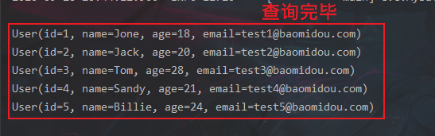
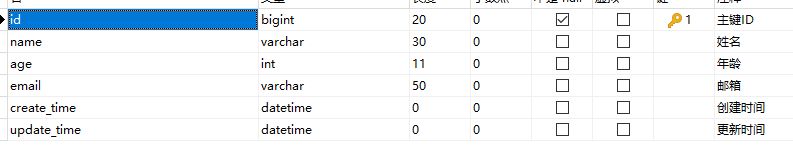

# MyBatisPlus

学习MyBatis-Plus之前要先学MyBatis–>Spring—>SpringMVC

为什么要学它?MyBatisPlus可以节省我们大量的时间,所有CRUD代码都可以自动完成

JPA, tk-mapper ,MyBatisPlus

偷懒用的!

> 1.简介

是什么?

官网:https://baomidou.com/


> 2.特性


- **无侵入**：只做增强不做改变，引入它不会对现有工程产生影响，如丝般顺滑
- **损耗小**：启动即会自动注入基本 CURD，性能基本无损耗，直接面向对象操作
- **强大的 CRUD 操作**：内置通用 Mapper、通用 Service，仅仅通过少量配置即可实现单表大部分 CRUD 操作，更有强大的条件构造器，满足各类使用需求
- **支持 Lambda 形式调用**：通过 Lambda 表达式，方便的编写各类查询条件，无需再担心字段写错
- **支持主键自动生成**：支持多达 4 种主键策略（内含分布式唯一 ID 生成器 - Sequence），可自由配置，完美解决主键问题
- **支持 ActiveRecord 模式**：支持 ActiveRecord 形式调用，实体类只需继承 Model 类即可进行强大的 CRUD 操作
- **支持自定义全局通用操作**：支持全局通用方法注入（ Write once, use anywhere ）
- **内置代码生成器**：采用代码或者 Maven 插件可快速生成 Mapper 、 Model 、 Service 、 Controller 层代码，支持模板引擎，更有超多自定义配置等您来使用
- **内置分页插件**：基于 MyBatis 物理分页，开发者无需关心具体操作，配置好插件之后，写分页等同于普通 List 查询
- **分页插件支持多种数据库**：支持 MySQL、MariaDB、Oracle、DB2、H2、HSQL、SQLite、Postgre、SQLServer 等多种数据库
- **内置性能分析插件**：可输出 Sql 语句以及其执行时间，建议开发测试时启用该功能，能快速揪出慢查询
- **内置全局拦截插件**：提供全表 delete 、 update 操作智能分析阻断，也可自定义拦截规则，预防误操作

## 1.快速入门

地址:https://mp.baomidou.com/guide/quick-start.html#%E5%88%9D%E5%A7%8B%E5%8C%96%E5%B7%A5%E7%A8%8B

使用第三方插件:

1. 导入对应的依赖
2. 研究依赖如何配置
3. 代码如何编写
4. 提高扩展技术能力
   

> 步骤

1. 创建数据库 `mybatis_plus`

2. 创建数据库

创建表

```mysql
DROP TABLE IF EXISTS user;

CREATE TABLE user
(
	id BIGINT(20) NOT NULL COMMENT '主键ID',
	name VARCHAR(30) NULL DEFAULT NULL COMMENT '姓名',
	age INT(11) NULL DEFAULT NULL COMMENT '年龄',
	email VARCHAR(50) NULL DEFAULT NULL COMMENT '邮箱',
	PRIMARY KEY (id)
);
```

插入数据

```mysql
DELETE FROM user;

INSERT INTO user (id, name, age, email) VALUES
(1, 'Jone', 18, 'test1@baomidou.com'),
(2, 'Jack', 20, 'test2@baomidou.com'),
(3, 'Tom', 28, 'test3@baomidou.com'),
(4, 'Sandy', 21, 'test4@baomidou.com'),
(5, 'Billie', 24, 'test5@baomidou.com');
```


3. 编写项目,初始化项目! 使用SpringBoot初始化!
4. 导入依赖

```xml
<!--        MySQL驱动-->
        <dependency>
            <groupId>mysql</groupId>
            <artifactId>mysql-connector-java</artifactId>
            <version>8.0.25</version>
        </dependency>

<!--        Lombok-->
        <dependency>
            <groupId>org.projectlombok</groupId>
            <artifactId>lombok</artifactId>
            <version>1.18.20</version>
        </dependency>

<!--        MyBatis-Plus是自己开发的并非官方的-->
        <dependency>
            <groupId>com.baomidou</groupId>
            <artifactId>mybatis-plus-boot-starter</artifactId>
            <version>3.0.5</version>
        </dependency>
```

**说明:我们使用mybatis-plus 可以节省我们大量的代码,尽量不要同时导入mybatis和mybatis-plus因为版本有差异!**

5. 连接数据库!这一步和mybatis相同!

```properties
# mysql 5 驱动：com.mysql.jdbc.Driver


# mysql8 驱动：com.mysql.cj.jdbc.Driver        还需要增加时区配置：&serverTimezone=UTC
spring.datasource.username=root
spring.datasource.password=zyc766623393
spring.datasource.url=jdbc:mysql://localhost:3306/mybatis_plus?useSSL=true&useUnicode=true&characterEncoding=utf-8&serverTimezone=UTC
spring.datasource.driver-class-name=com.mysql.cj.jdbc.Driver

```

`6.传统的方式: pojo-dao(连接mybatis,配置mapper.xml文件)-service-controller`

6. 使用了mybatis-plus之后

* pojo->User

```java
package com.zhou.pojo;

import lombok.AllArgsConstructor;
import lombok.Data;
import lombok.NoArgsConstructor;

@Data
@AllArgsConstructor
@NoArgsConstructor
public class User {

    private Long id;
    private String name;
    private Integer age;
    private String email;
}
```

* mapper接口 	

```java
package com.zhou.mapper;

import com.baomidou.mybatisplus.core.mapper.BaseMapper;
import com.zhou.pojo.User;
import org.springframework.stereotype.Repository;

//使用MyBatis不需要写mapper.xml文件
//只需要在对应的mapper接口继承BaseMapper类
@Repository  //加上注解，代表是持久层的
public interface UserMapper extends BaseMapper<User> {
//    所有CRUD就已经全部完成，都是MyBatis帮我们做了
//    不需要像MyBatis一样，写一大堆配置
//    继承了所有方法，同时也可以自己写方法
}

```

注意点:需要在主启动类`MybatisPlusApplication`上扫描我们Mapper包下的所有接口:  `@MapperScan("com.codeyuaiiao.mapper")`

主程序：

```java
package com.zhou;

import org.mybatis.spring.annotation.MapperScan;
import org.springframework.boot.SpringApplication;
import org.springframework.boot.autoconfigure.SpringBootApplication;

//配置扫描包，需要扫描接口包
@MapperScan("com.zhou.mapper")
@SpringBootApplication
public class MybatisPlus01StartApplication {

    public static void main(String[] args) {
        SpringApplication.run(MybatisPlus01StartApplication.class, args);
    }

}
```

* 测试类中测试

```java
package com.zhou;

import com.zhou.mapper.UserMapper;
import com.zhou.pojo.User;
import org.junit.jupiter.api.Test;
import org.springframework.beans.factory.annotation.Autowired;
import org.springframework.boot.test.context.SpringBootTest;

import java.util.List;

@SpringBootTest
class MybatisPlus01StartApplicationTests {

    @Autowired
    private UserMapper userMapper;

    @Test
    void contextLoads() {
//        参数是一个Wrapper，条件构造器，这里先使用null
        List<User> userList = userMapper.selectList(null); //查询全部user
        userList.forEach(System.out::println);
    }

}
```

* 查询结果:



> 思考问题
>
> 1. sql谁帮我们写的?—mybatis-plus
> 2. 方法谁帮我们写的?—mybatis-plus

## 2.配置日志

所有的sql是不可见的,我们希望知道他是怎么执行的,所以我们必须看日志!

```properties
# 配置日志  (默认控制台输出)
mybatis-plus.configuration.log-impl=org.apache.ibatis.logging.stdout.StdOutImpl
```


配置完日志之后你会喜欢上mybatis-plus!

## 3.CRUD扩展

### 1.插入数据

```java
//    测试插入
    @Test
    public void testInsert(){
        User user = new User();
        user.setAge(21);
        user.setName("zyc");
        user.setEmail("766623393@qq.com");  //自动生成id
        int res = userMapper.insert(user);  //返回影响行数
        System.out.println(res);    //发现id自动生成
    }
```


> 注意点:数据库插入的id默认值为:全局的唯一id

### 2.主键生成策略

> 默认 ID_WORKER 全局唯一id
>
> 对应数据库中的主键(uuid.自增id.雪花算法.redis.zookeeper)

分布式系统唯一id生成:

[]: https://www.cnblogs.com/haoxinyue/p/5208136.html

**雪花算法**（**Twitter的snowflake算法**)

snowflake是Twitter开源的分布式ID生成算法，结果是一个long型的ID。其核心思想是：使用41bit作为毫秒数，10bit作为机器的ID（5个bit是数据中心，5个bit的机器ID），12bit作为毫秒内的流水号（意味着每个节点在每毫秒可以产生 4096 个 ID），最后还有一个符号位，永远是0.可以保证几乎全球唯一

> 主键自增

我们需要配置主键自增:

1. 实体类字段上`@TableId(type = IdType.AUTO)`
2. 数据库字段一定要是**自增**!


> 其余源码解释

```java
public enum IdType {
     
    AUTO(0),//数据库ID自增  
    NONE(1),//该类型为未设置主键类型      
    INPUT(2),//用户输入ID，如果不输入就是null
      		 //该类型可以通过自己注册自动填充插件进行填充  
    
	//以下3种类型、只有当插入对象ID 为空，才自动填充。     
    ID_WORKER(3),//默认的，全局唯一ID (idWorker)      
    UUID(4),//全局唯一ID (UUID)          
    ID_WORKER_STR(5);//字符串全局唯一ID (idWorker 的字符串表示)    
```

### 3.更新数据

> 动态生成SQL

`注意:updateById()参数是 一个对象!`

测试更新

```java
//    测试更新
    @Test
    public void testUpdate(){
        User user = new User();
        user.setAge(18);
        user.setName("ZJ");
        user.setEmail("766623393@qq.com");
//        会自动生成sql，会根据字段自动匹配
        int res = userMapper.updateById(user);  //注意这个参数是一个对象
        System.out.println(res);    //返回影响行数
    }
```


所有的sql都是动态帮你配置的

### 4.自动填充

创建时间 . 修改时间! 这些个操作都是自动化完成的,我们不希望手动更新!

阿里巴巴开发手册:所有的数据库表:gmt_create .gmt_modified几乎所有的表都要配置上!而且需要自动化!

> 方式一:数据库级别

1. 在表中新增字段 create_time , update_time


2. 再次测试插入方法,我们需要先把实体类同步

```java
package com.zhou.pojo;

import com.baomidou.mybatisplus.annotation.FieldFill;
import com.baomidou.mybatisplus.annotation.IdType;
import com.baomidou.mybatisplus.annotation.TableField;
import com.baomidou.mybatisplus.annotation.TableId;
import lombok.AllArgsConstructor;
import lombok.Data;
import lombok.NoArgsConstructor;

import java.util.Date;

@Data
@AllArgsConstructor
@NoArgsConstructor
public class User {

//    对应数据库的主键（uuid，自增id，雪花算法，redis，zookeeper）
    @TableId(type = IdType.ID_WORKER)
    private Long id;
    private String name;
    private Integer age;
    private String email; 
    private Date createTime;
    private Date updateTime;
}
```

再次更新查看结果即可

> 方式二:代码级别

1. 删除数据库默认值



2. 实体类字段属性上添加注解

```java
//记住用util包下的Date!!
//字段添加填充内容
@TableField(fill = FieldFill.INSERT)
private Data creatTime;

@TableField(fill = FieldFill.INSERT_UPDATE)
private Data updateTime;
```

3. 编写处理器来处理这个注解，创建一个handler包，创建一个MyMetaObjectHandler类

```java
package com.zhou.handler;

import com.baomidou.mybatisplus.core.handlers.MetaObjectHandler;
import lombok.extern.slf4j.Slf4j;
import org.apache.ibatis.reflection.MetaObject;
import org.springframework.stereotype.Component;

import java.util.Date;

//打印日志输出
@Slf4j
//交给Spring管理，加入IOC容器中
@Component
public class MyMetaObjectHandler implements MetaObjectHandler {

//    插入时填充
    @Override
    public void insertFill(MetaObject metaObject) {

        log.info("start insert fill ....");
//        MetaObjectHandler setFieldValByName(String fieldName, Object fieldVal, MetaObject metaObject)
        this.setFieldValByName("createTime",new Date(),metaObject);
        this.setFieldValByName("updateTime",new Date(),metaObject);
    }

//    更新时填充
    @Override
    public void updateFill(MetaObject metaObject) {

        log.info("start update fill ....");
        this.setFieldValByName("updateTime",new Date(),metaObject);
    }
}

```

4. 测试插入

5. 测试更新,观察时间即可!

### 5.乐观锁&悲观锁

> 乐观锁: 顾名思义十分乐观,他总是认为不会出现问题,无论干什么都不去上锁!如果出现了问题,再次更新值测试
>
> 悲观锁;顾名思义十分悲观,他总是认为出现问题,无论干什么都会上锁!再去操作!

我们这里主要讲解 乐观锁机制!

乐观锁实现方式:

- 取出记录时,获取当前version
- 更新时,带上这个version
- 执行更新时,set version = newVersion where version = oldVersion
- 如果version不对,就更新失败

1. 首先在数据库中加上version字段


2. 改写实体类

```java
import com.baomidou.mybatisplus.annotation.*;
import lombok.AllArgsConstructor;
import lombok.Data;
import lombok.NoArgsConstructor;

import java.util.Date;

@Data
@AllArgsConstructor
@NoArgsConstructor
public class User {

//    对应数据库的主键（uuid，自增id，雪花算法，redis，zookeeper）
    @TableId(type = IdType.ID_WORKER)
    private Long id;
    private String name;
    private Integer age;
    private String email;

//    乐观锁注解
    @Version
    private Integer version;

//    字段添加填充内容
    @TableField(fill = FieldFill.INSERT)
    private Date createTime;

    @TableField(fill = FieldFill.INSERT_UPDATE)
    private Date updateTime;
}
```

3. 编写乐观锁配置

```java
package com.zhou.config;

import com.baomidou.mybatisplus.extension.plugins.OptimisticLockerInterceptor;
import org.mybatis.spring.annotation.MapperScan;
import org.springframework.context.annotation.Bean;
import org.springframework.context.annotation.Configuration;
import org.springframework.transaction.annotation.EnableTransactionManagement;

//扫描mapper包
@MapperScan("com.zhou.mapper")
//开启事务注解
@EnableTransactionManagement
@Configuration  //代表是配置类
public class MyBatisPlusConfig {

//    注册乐观锁组件
    @Bean
    public OptimisticLockerInterceptor optimisticLockerInterceptor(){
        return new OptimisticLockerInterceptor();
    }

}

```

4. 测试

```java
//    测试乐观锁成功
    @Test
    public void testOptimisticLocker(){
//        查询用户信息
        User user = userMapper.selectById(1L);
//        修改用户信息
        user.setName("ZYC");
        user.setEmail("766623393@qq.com");
//        执行更新操作
        userMapper.updateById(user);

    }

    //    测试乐观锁失败，模拟多线程下
    @Test
    public void testOptimisticLocker2() {
//        线程1
//        查询用户信息
        User user = userMapper.selectById(1L);
//        修改用户信息
        user.setName("ZYC111");
        user.setEmail("766623393@qq.com");

//        线程2
//        查询用户信息
        User user2 = userMapper.selectById(1L);
//        修改用户信息
        user2.setName("ZYC222");
        user2.setEmail("766623393@qq.com");
//        线程2执行更新操作
        userMapper.updateById(user2);

//        线程1执行更新操作
//        如果想数据库中的值是第一次的值，可以使用自旋锁，多次尝试提交
        userMapper.updateById(user);  //如果没有乐观锁，线程1的值会覆盖线程2的值

    }
```

### 6.查询操作

测试查询

```java
//    测试查询
    public void testSelect(){
//        查询一个
        User user = userMapper.selectById(1L);
        System.out.println(user);
//        查询多个
        List<User> users = userMapper.selectBatchIds(Arrays.asList(1L, 2L, 3L));
        users.forEach(System.out::println);
    }

//    条件查询 map
    @Test
    public void testSelectByIf(){
        HashMap<String, Object> map = new HashMap<>();
//        设置要查询的条件
        map.put("name","zyc");
//        可以多条件
        map.put("age",21);
        List<User> users = userMapper.selectByMap(map);
        users.forEach(System.out::println);
    }
```

### 7.分页查询

1. 在MyBatisConfig类中引入分页插件，详见官网

```java
package com.zhou.config;

import com.baomidou.mybatisplus.extension.plugins.OptimisticLockerInterceptor;
import com.baomidou.mybatisplus.extension.plugins.PaginationInterceptor;
import org.mybatis.spring.annotation.MapperScan;
import org.springframework.context.annotation.Bean;
import org.springframework.context.annotation.Configuration;
import org.springframework.transaction.annotation.EnableTransactionManagement;

//扫描mapper包
@MapperScan("com.zhou.mapper")
//开启事务注解
@EnableTransactionManagement
@Configuration  //代表是配置类
public class MyBatisPlusConfig {

//    注册乐观锁组件
    @Bean
    public OptimisticLockerInterceptor optimisticLockerInterceptor(){
        return new OptimisticLockerInterceptor();
    }

//    分页插件
    @Bean
    public PaginationInterceptor paginationInterceptor() {
         return new PaginationInterceptor();
    }

}
```

2. 测试查询

```java
//    分页测试
    public void testPage(){
//        参数一：当前页
//        参数二：页面大小
//        使用了分页插件之后，所有的分页也变得简单
        Page<User> userPage = new Page<>(1,5);
        userMapper.selectPage(userPage,null);

        userPage.getRecords().forEach(System.out::println);
//        获取总数
        System.out.println(userPage.getTotal());
    }
```

### 8.删除操作

基本的删除测试：

```java
//    测试删除
    @Test
    public void testDelete(){
//        通过id删除
        userMapper.deleteById(1L);
//        批量删除
        userMapper.deleteBatchIds(Arrays.asList(1L,2L,3L));
//        通过map删除
        HashMap<String, Object> map = new HashMap<>();
//        删除名字是zyc的
        map.put("name","zyc");
        userMapper.deleteByMap(map);
    }
```

在工作中经常遇到逻辑删除

### 9.逻辑删除

>物理删除:从数据库中直接移除
>
>逻辑删除: 在数据库中没有被移除,而是通过一个变量来让他失效! deleted=0=>deleted=1

管理员可以查看被删除的记录!防止数据的丢失,类似于回收站!

步骤：

1. 在数据表中增加一个deleted字段


2. 实体类中增加属性

```java
//    逻辑删除
    @TableLogic
    private Integer deleted;

```

3. 在MyBatisPlusConfig中配置

```java
//    逻辑删除组件
    @Bean
    public ISqlInjector iSqlInjector(){
        return new LogicSqlInjector();
    }
```

4. 在application.properties中配置

```properties
# 配置逻辑删除
mybatis-plus.global-config.db-config.logic-delete-value=1
mybatis-plus.global-config.db-config.logic-not-delete-value=0
```

5. 测试

走的是更新操作,不是删除操作


查询的时候会自动过滤删除的数据


以上的所有CRUD操作及其扩展,我们都必须精通掌握!会大大提好你的工作和写项目的效率

## 4.性能分析插件

我们在平时的开发中,会遇到一些慢sql.

MyBatisPlus也提供了性能分析插件,如果超过这个时间就停止运行!

1. 导入插件

```java
//    导入sql执行效率的插件
    @Bean
    @Profile({"dev", "test"}) //设置dev 和 test环境开启，保证效率
    public PerformanceInterceptor performanceInterceptor() {
        PerformanceInterceptor performanceInterceptor = new PerformanceInterceptor();
//        在工作中常用，如果有慢sql需要优化
        performanceInterceptor.setMaxTime(100);   //ms  设置sql执行的最大时间
        performanceInterceptor.setFormat(true);    //是否格式化代码
        return performanceInterceptor;
    }
```

**记住，要在SpringBoot中配置环境为dev或者test环境**

```properties
#设置开发环境
spring.profiles.active=dev
```

2. 测试使用


`只要超过时间限制就会抛出异常`

## 5.条件构造器

详情见官网：

https://mp.baomidou.com/guide/wrapper.html#abstractwrapper

### 测试1：

```java
 @Test
    void contextLoads(){
//         查询name不为空，email不为空，年龄大于12
        QueryWrapper<User> wrapper = new QueryWrapper<>();
        wrapper.isNotNull("name")
                .isNotNull("email")
                .ge("age",12);
//        与之前的map类似
        List<User> users= userMapper.selectList(wrapper);
        users.forEach(System.out::println);
    }
```

### 测试2：

```java
  @Test
    void test2(){
//        查询id为1的
        QueryWrapper<User> wrapper = new QueryWrapper<>();
        wrapper.eq("id",1);
        User user = userMapper.selectOne(wrapper);
        System.out.println(user);
    }
```

### 测试3：

```java
 @Test
    void test3(){
//        查询年龄在20-30岁的人数
        QueryWrapper<User> wrapper = new QueryWrapper<>();
        wrapper.between("age",20,30);
        Integer count = userMapper.selectCount(wrapper);
        System.out.println(count);
    }
```

### 测试4：

```java
//    模糊查寻
    @Test
    void test4(){
        QueryWrapper<User> wrapper = new QueryWrapper<>();
//        没有e
        wrapper.notLike("name","e")
                .likeRight("email","t");    //t%
        List<Map<String, Object>> maps = userMapper.selectMaps(wrapper);
        maps.forEach(System.out::println);
    }
```

### 测试五：

```java
//    模糊查询
    @Test
    void test5(){
        QueryWrapper<User> wrapper = new QueryWrapper<>();
//        id在子查询中查出，就是in查询
        wrapper.inSql("id","select id from where id < 3");

        List<Object> objects = userMapper.selectObjs(wrapper);
        objects.forEach(System.out::println);
    }
```

### 测试六：

```java
//    排序
    @Test
    void test6() {
        QueryWrapper<User> wrapper = new QueryWrapper<>();
//        通过id排序
        wrapper.orderByDesc("id");

        List<User> users = userMapper.selectList(wrapper);
        users.forEach(System.out::println);
    }
```

## 6.代码自动生成

**非常牛逼**

```java
import com.baomidou.mybatisplus.annotation.DbType; import com.baomidou.mybatisplus.annotation.FieldFill; import com.baomidou.mybatisplus.annotation.IdType; import com.baomidou.mybatisplus.annotation.TableField; import com.baomidou.mybatisplus.generator.AutoGenerator; import com.baomidou.mybatisplus.generator.config.DataSourceConfig; import com.baomidou.mybatisplus.generator.config.GlobalConfig; import com.baomidou.mybatisplus.generator.config.PackageConfig; import com.baomidou.mybatisplus.generator.config.StrategyConfig; import com.baomidou.mybatisplus.generator.config.po.TableFill; import com.baomidou.mybatisplus.generator.config.rules.DateType; import com.baomidou.mybatisplus.generator.config.rules.NamingStrategy; import java.util.ArrayList; 

// 代码自动生成器 
public class KuangCode {
public static void main(String[] args) {
    // 需要构建一个 代码自动生成器 对象 
    AutoGenerator mpg = new AutoGenerator(); 
    
    // 配置策略 
    // 1、全局配置 
    GlobalConfig gc = new GlobalConfig();
    String projectPath = System.getProperty("user.dir"); 
    gc.setOutputDir(projectPath+"/src/main/java");
    gc.setAuthor("狂神说"); gc.setOpen(false);
    gc.setFileOverride(false);// 是否覆盖
    gc.setServiceName("%sService"); // 去Service的I前缀
    gc.setIdType(IdType.ID_WORKER);
    gc.setDateType(DateType.ONLY_DATE);
    gc.setSwagger2(true);
    mpg.setGlobalConfig(gc);
    
    //2、设置数据源
    DataSourceConfig dsc = new DataSourceConfig();
    dsc.setUrl("jdbc:mysql://localhost:3306/kuang_community? useSSL=false&useUnicode=true&characterEncoding=utf-8&serverTimezone=GMT%2B8");
    dsc.setDriverName("com.mysql.cj.jdbc.Driver");
    dsc.setUsername("root");
    dsc.setPassword("123456");
    dsc.setDbType(DbType.MYSQL); mpg.setDataSource(dsc);
    
    //3、包的配置
    PackageConfig pc = new PackageConfig();
    //只需要改实体类名字 和包名 还有 数据库配置即可
    pc.setModuleName("blog"); 
    pc.setParent("com.kuang");
    pc.setEntity("entity"); 
    pc.setMapper("mapper");
    pc.setService("service"); 
    pc.setController("controller");
    mpg.setPackageInfo(pc);
    
    //4、策略配置
    StrategyConfig strategy = new StrategyConfig();
  strategy.setInclude("blog_tags","course","links","sys_settings","user_record"," user_say");
    
    // 设置要映射的表名
    strategy.setNaming(NamingStrategy.underline_to_camel);
    strategy.setColumnNaming(NamingStrategy.underline_to_camel);
    strategy.setEntityLombokModel(true);
    
    // 自动lombok；
    strategy.setLogicDeleteFieldName("deleted"); 
    
    // 自动填充配置
    TableFill gmtCreate = new TableFill("gmt_create", FieldFill.INSERT);
    TableFill gmtModified = new TableFill("gmt_modified", FieldFill.INSERT_UPDATE);
    ArrayList<TableFill> tableFills = new ArrayList<>();
    tableFills.add(gmtCreate); tableFills.add(gmtModified);
    strategy.setTableFillList(tableFills);
    
    // 乐观锁
    strategy.setVersionFieldName("version");
    strategy.setRestControllerStyle(true);
    
    strategy.setControllerMappingHyphenStyle(true);// localhost:8080/hello_id_2 
    mpg.setStrategy(strategy);
    
    mpg.execute(); //执行 
	}
}
```
