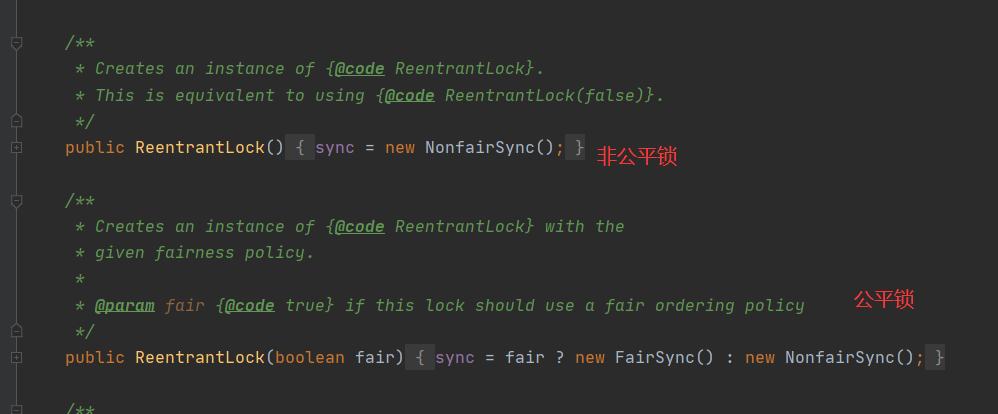
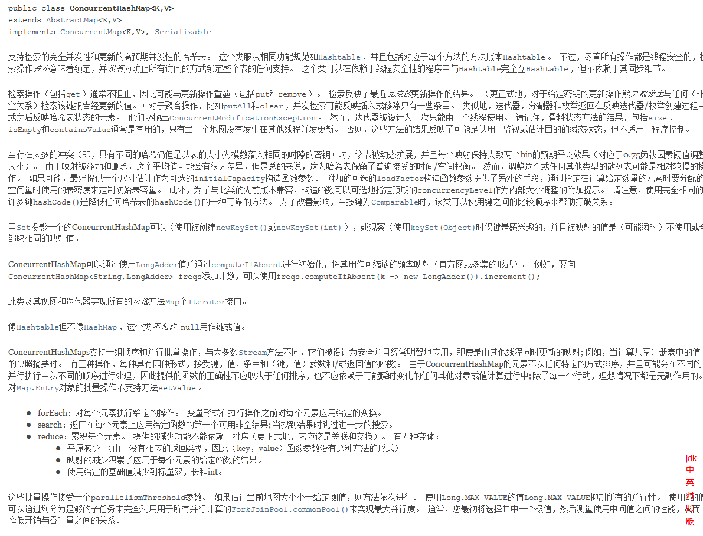
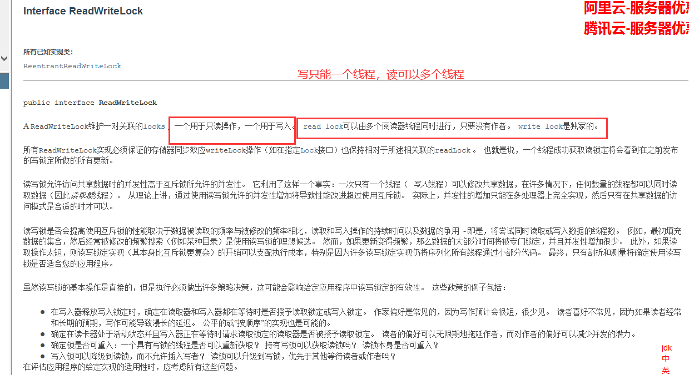
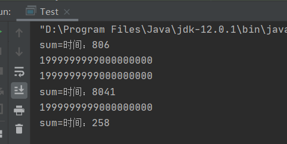

# JUC

## 1、什么是JUC

1、什么是juc（学习方法：官方文档+源码）


java.util：java的工具包，包，分类
什么是juc：java.util.concurrent，java工具类下的一个并发功能的包。

Runnable 没有返回值、效率相比入 Callable相对较低!

* 两者都属于juc里面


* 但callable可以返回结果，也可以抛出异常


所以比起runable来说，callable有以下特点：
1、有返回值
2、可以抛出异常
3、方法不同，run（），call（）

## 2、进程和线程回顾

> 进程:一个程序，QQ.exe Music.exe程序的线程的集合;

* 一个进程往往可以包含多个线程，至少包含一个!
* Java默认有几个线程?最少2个，mian、GC
* 举例说明：开了一个进程Typora（开启进程），写字（一个线程），自动保存（又一个线程线程)
* 对于Java而言调用多线程的方法:Thread、Runnable（静态代理）、Callable（静态代理）

**java真的可以开启线程嘛？(面试题)**
不行，因为开启线程需要调用start0（），这是个本地方法，使用的是底层c++。

```java
    public synchronized void start() {
        /**
         * This method is not invoked for the main method thread or "system"
         * group threads created/set up by the VM. Any new functionality added
         * to this method in the future may have to also be added to the VM.
         *
         * A zero status value corresponds to state "NEW".
         */
        if (threadStatus != 0)
            throw new IllegalThreadStateException();

        /* Notify the group that this thread is about to be started
         * so that it can be added to the group's list of threads
         * and the group's unstarted count can be decremented. */
        group.add(this);

        boolean started = false;
        try {
            start0();
            started = true;
        } finally {
            try {
                if (!started) {
                    group.threadStartFailed(this);
                }
            } catch (Throwable ignore) {
                /* do nothing. If start0 threw a Throwable then
                  it will be passed up the call stack */
            }
        }
    }

// 本地方法：底层的C++，Java无法直接操作硬件，
    private native void start0();
```


**并发、并行：**
并发(多线程操作同一个资源)

* CPU一核，模拟出来多条线程，天下武功，唯快不破，快速交替


并行(多个人一起行走)

* CPU多核，多个线程可以同时执行;线程池
  

```java
package com.zhou.demo1;

public class Test1 {

    public static void main(String[] args) {

//        获取CPU核数
//        CPU  密集型   　IO  密集型
        System.out.println(Runtime.getRuntime().availableProcessors());
        new Thread().start();
        
    }
}
```

**并发编程的本质:充分利用CPU的资源**

> 线程有几个状态：java有6个状态，操作系统有5个

```java
public enum State {
   //新生
    NEW,
    //运行
RUNNABLE,
    //阻塞
    BLOCKED,
    //无限期等待
    WAITING,
    //限时等待
    TIMED_WAITING,
    //终止
    TERMINATED;
}
```

java的Thread.State源码中操作系统的五个状态：初始状态（NEW) ，可运行状态（READY），运行状态（RUNNING) ，等待状态（WAITING) ，终止状态（TERMINATED）。

区别：
当线程调用阻塞式 API时，进程(线程)进入等待状态，这里指的是操作系统层面的。从 JVM层面来说，Java线程仍然处于 RUNNABLE 状态。JVM 并不关心操作系统线程的实际状态，从 JVM 看来，等待CPU使用权（操作系统状态为可运行态）与等待 I/O（操作系统处于等待状态）没有区别，都是在等待某种资源，所以都归入RUNNABLE 状态

> **wait/sleep区别：**

1. **来自不同的类**

   wait   --> object
   sleep --> Thread
   常用的休眠方法：使用java.util.concurrent里的TimeUnit

```java
TimeUnit.SECONDS.sleep(1);
TimeUnit.DAYS.sleep(2);
```

2. **关于锁的释放**
wait 会释放锁，sleep睡觉了，抱着锁睡觉，不会释放!
3. **使用的范围不同**
    wait：必须在同步代码块。
    sleep：可在任何地方睡。
    **即有synchronized修饰符修饰的语句块，被该关键词修饰的语句块，将加上内置锁。实现同步。**
    例：synchronized(Object o ){}
4. **是否需要捕获异常，两者都需要捕获异常**
    wait：不需要捕获异常（中断异常除外）
    sleep：必须要捕获异常

## 3、Lock锁

> 传统的Synchronized

```java
package com.zhou.demo1;

//基本的买票例子

/**
 * 真正的多线程开发，公司中的线程开发,一定要降低耦合
 * 线程就是一个单独的资源类，没有任何的附属操作
 * 1，属性、方法
 *
 */
public class SaleTicketDemo1 {
    public static void main(String[] args) {

//        并发，多个线程操作同一个资源，把资源丢入线程即可
        Ticket ticket  = new Ticket();

//    @FunctionalInterface    Thread 参数为一个函数式接口：JDK1.8之后， lambda表达式，(参数)->{函数体}
        new Thread( () ->{
            for (int i = 0; i < 50; i++) {
                ticket.sale();
            }
        },"A").start();
        new Thread(() ->{
            ticket.sale();
        },"B").start();
        new Thread(()->{
            ticket.sale();
        },"C").start();
    }
}

//资源类  OOP思想
class Ticket{
//    属性和方法
    private int num = 50;

//    卖票方式
//    synchronized 本质：队列和锁
    public synchronized void sale(){
        if(num>0){
            System.out.println(Thread.currentThread().getName()+"卖出了"+num--+"票,剩余"+num);
        }
    }
}
```

> Lock锁

* 属于JUC包下，是一个接口，实现类有读写锁和可重入锁（reentrantlock）




公平锁：十分公平，可以先来后到

非公平锁：十分不公平，可以插队（默认）

```java
package com.zhou.demo1;

//基本的买票例子

import java.util.concurrent.locks.Lock;
import java.util.concurrent.locks.ReentrantLock;

/**
 * 真正的多线程开发，公司中的线程开发,一定要降低耦合
 * 线程就是一个单独的资源类，没有任何的附属操作
 * 1，属性、方法
 *
 */
public class SaleTicketDemo2 {
    public static void main(String[] args) {

//        并发，多个线程操作同一个资源，把资源丢入线程即可
        Ticket2 ticket  = new Ticket2();

//    @FunctionalInterface    Thread 参数为一个函数式接口：JDK1.8之后， lambda表达式，(参数)->{函数体}
        new Thread(()->{
            for (int i = 0; i < 50; i++) {
                ticket.sale();
            }
        },"A").start();
        new Thread(() ->{
            ticket.sale();
        },"B").start();
        new Thread(()->{
            ticket.sale();
        },"C").start();
    }
}

//Lock三部曲
//1.new ReentrantLick()
//2.加锁  lock.lock()
//3.finally  ==>  lock.unlock  解锁
class Ticket2{
    //    属性和方法
    private int num = 50;
    Lock lock  = new ReentrantLock();
    public  void sale(){
        lock.lock();
        try {
//            业务代码
            if(num>0){
                System.out.println(Thread.currentThread().getName()+"卖出了"+num--+"票,剩余"+num);
            }
        }catch (Exception e){
            e.printStackTrace();
        }finally {
            lock.unlock();//解锁
        }

    }
}
```

> Synchronized和Lock区别：

1、Synchronized 内置的Java关键字，Lock是一个Java类
2、Synchronized无法判断获取锁的状态，Lock 可以判断是否获取到了锁
3、Synchronized 会自动释放锁，lock 必须要手动释放锁!如果不释放锁，死锁
4、Synchronized线程1(获得锁，阻塞)、线程2(等待，傻傻的等） ; Lock锁就不一定会等待下去;
5、Synchronized 可重入锁，不可以中断的，非公平;Lock，可重入锁，可判断锁，默认非公平(可以自己设置）;
6、Synchronized适合锁少量的代码同步问题，Lock适合锁大量的同步代码!

> 锁是什么，如何判断锁是谁？

## 4、生产者消费者问题

**Synchronized wait notify**可以实现，该方法是传统版本；

我们这次使用lock版本

面试：单例模式，排序算法，生产者消费者，死锁

>生产者消费者问题，Synchronized版

```java
package com.zhou.pc;

/**
 * 线程之间的通信问题:生产者消费者问题,   等待唤醒,  通知唤醒
 * 线程交替执行, A  B  同时操作一个变量,  num=0
 * A:num +1
 * B:num -1
 */
public class A {
    public static void main(String[] args) {
        Data data = new Data();

        new Thread(()->{
            try {
                for (int i = 0; i < 10; i++) {
                    data.increment();
                }
            } catch (InterruptedException e) {
                e.printStackTrace();
            }
        },"A").start();

        new Thread(()->{
            try {
                for (int i = 0; i < 10; i++) {
                    data.decrement();
                }
            } catch (InterruptedException e) {
                e.printStackTrace();
            }
        },"B").start();


    }
}

//判断等待,业务,通知
class Data{//数字,资源类
    private int number=0;

//    +1
    public synchronized void increment() throws InterruptedException {
        if (number!=0){
//            等待
            this.wait();
        }
        number++;
        System.out.println(Thread.currentThread().getName()+"=>"+number);
//        通知其他线程+1完毕
        this.notifyAll();
    }

//    -1
    public synchronized void decrement() throws InterruptedException {
        if (number==0){
//            等待
            this.wait();
        }
        number--;
        System.out.println(Thread.currentThread().getName()+"=>"+number);
//        通知其他线程-1完毕
        this.notifyAll();
    }
}

```

**两个线程下，这个是正常执行，101010，但是四个线程就会出现2，3等情况，该问题是由于虚假唤醒造成的，如何解决？**

```java
package com.zhou.pc;

/**
 * 线程之间的通信问题:生产者消费者问题,   等待唤醒,  通知唤醒
 * 线程交替执行, A  B  同时操作一个变量,  num=0
 * A:num +1
 * B:num -1
 */
public class A {
    public static void main(String[] args) {
        Data data = new Data();

        new Thread(()->{
            try {
                for (int i = 0; i < 10; i++) {
                    data.increment();
                }
            } catch (InterruptedException e) {
                e.printStackTrace();
            }
        },"A").start();

        new Thread(()->{
            try {
                for (int i = 0; i < 10; i++) {
                    data.decrement();
                }
            } catch (InterruptedException e) {
                e.printStackTrace();
            }
        },"B").start();
        new Thread(()->{
            try {
                for (int i = 0; i < 10; i++) {
                    data.increment();
                }
            } catch (InterruptedException e) {
                e.printStackTrace();
            }
        },"C").start();

        new Thread(()->{
            try {
                for (int i = 0; i < 10; i++) {
                    data.decrement();
                }
            } catch (InterruptedException e) {
                e.printStackTrace();
            }
        },"D").start();

    }
}

//判断等待,业务,通知
class Data{//数字,资源类
    private int number=0;

//    +1
    public synchronized void increment() throws InterruptedException {
        if (number!=0){
//            等待
            this.wait();
        }
        number++;
        System.out.println(Thread.currentThread().getName()+"=>"+number);
//        通知其他线程+1完毕
        this.notifyAll();
    }

//    -1
    public synchronized void decrement() throws InterruptedException {
        if (number==0){
//            等待
            this.wait();
        }
        number--;
        System.out.println(Thread.currentThread().getName()+"=>"+number);
//        通知其他线程-1完毕
        this.notifyAll();
    }
}

```


**解决方案**： **if 改为while即可，防止虚假唤醒**

这样就不存在问题了：

> **JUC版本的生产者和消费者问题**

**await、signal 替换 wait、notify**


通过Lock找到Condition


```java
package com.zhou.pc;

import java.util.concurrent.locks.Condition;
import java.util.concurrent.locks.Lock;
import java.util.concurrent.locks.ReentrantLock;

public class B {
    public static void main(String[] args) {
        Data2 data = new Data2();
        new Thread(()->{
            try {
                for (int i = 0; i < 10; i++) {
                    data.increment();
                }
            } catch (InterruptedException e) {
                e.printStackTrace();
            }
        },"A").start();

        new Thread(()->{
            try {
                for (int i = 0; i < 10; i++) {
                    data.decrement();
                }
            } catch (InterruptedException e) {
                e.printStackTrace();
            }
        },"B").start();
        new Thread(()->{
            try {
                for (int i = 0; i < 10; i++) {
                    data.increment();
                }
            } catch (InterruptedException e) {
                e.printStackTrace();
            }
        },"C").start();

        new Thread(()->{
            try {
                for (int i = 0; i < 10; i++) {
                    data.decrement();
                }
            } catch (InterruptedException e) {
                e.printStackTrace();
            }
        },"D").start();
    }
}
//判断等待,业务,通知
class Data2{//数字,资源类
    private int number=0;
    Lock lock = new ReentrantLock();
    Condition condition = lock.newCondition();
//    condition.await()  等待
//    condition.signalAll()  唤醒全部
    //    +1
    public  void increment() throws InterruptedException {
        lock.lock();
        try {
            while (number!=0){
    //            等待
               condition.await();
            }
            number++;
            System.out.println(Thread.currentThread().getName()+"=>"+number);
//        通知其他线程+1完毕
            condition.signalAll();
        } catch (InterruptedException e) {
            e.printStackTrace();
        } finally {
            lock.unlock();
        }
    }

    //    -1
    public void decrement() throws InterruptedException {
        lock.lock();
        try {
            while (number==0){
    //            等待
                condition.await();
            }
            number--;
            System.out.println(Thread.currentThread().getName()+"=>"+number);
//        通知其他线程-1完毕
            condition.signalAll();
        } catch (InterruptedException e) {
            e.printStackTrace();
        } finally {
            lock.unlock();
        }
    }
}
```

> **Condition的优势**：精准的通知和唤醒的线程！

**如果我们要指定通知的下一个进行顺序怎么办呢？ 我们可以使用Condition来指定通知进程~**

```java
package com.zhou.pc;

import java.util.concurrent.locks.Condition;
import java.util.concurrent.locks.Lock;
import java.util.concurrent.locks.ReentrantLock;

//        先执行A-->B--->C
public class C {
    public static void main(String[] args) {
        Data3 data3 = new Data3();
        new Thread(()->{
            for(int i=0;i<10;i++){
                data3.printA();
            }
        },"A").start();
        new Thread(()->{
            for(int i=0;i<10;i++){
                data3.printB();
            }
        },"B").start();
        new Thread(()->{
            for(int i=0;i<10;i++){
                data3.printC();
            }
        },"C").start();
    }
}
class Data3{
    //资源类
    private Lock lock=new ReentrantLock();
    private Condition condition1 = lock.newCondition();
    private Condition condition2 = lock.newCondition();
    private Condition condition3 = lock.newCondition();
    private int number = 1; //1A 2B 3C

    public void printA(){
        lock.lock();
        try {
            //业务 判断 -> 执行 -> 通知
            while(number!=1){
                //等待
                condition1.await();
            }
            //操作
            System.out.println(Thread.currentThread().getName()+",AAAAA");
            //唤醒指定的线程
            number=2;
            condition2.signal(); // 唤醒2

        } catch (Exception e) {
            e.printStackTrace();
        } finally {
            lock.unlock();
        }
    }
    public void printB(){
        lock.lock();
        try {
            //业务 判断 -> 执行 -> 通知
            while (number!=2){
                condition2.await();
            }
            System.out.println(Thread.currentThread().getName()+",BBBBB");
            //唤醒3
            number=3;
            condition3.signal();
        } catch (Exception e) {
            e.printStackTrace();
        } finally {
            lock.unlock();
        }
    }
    public void printC(){
        lock.lock();
        try {
            //业务 判断 -> 执行 -> 通知
            while(number!=3){
                condition3.await();
            }
            System.out.println(Thread.currentThread().getName()+",CCCCC");
            //唤醒1
            number=1;
            condition1.signal();
        } catch (Exception e) {
            e.printStackTrace();
        } finally {
            lock.unlock();
        }
    }
}
```

## 5、八锁现象

**如何判断锁的是谁！锁到底锁的是谁？**

锁会锁住：**对象、Class**

**深刻理解我们的锁**

- 问题1：


结果是：先发短信，如何再打电话！

**为什么？ 如果你认为是顺序在前？ 这个答案是错误的！**

- 问题2：

**我们再来看：我们让发短信 延迟4s**


现在结果是什么呢？

结果：**还是先发短信，然后再打电话！**

**why？**

#### 原因：并不是顺序执行！是因为synchronized 锁的对象是方法的调用！对于两个方法用的是同一个锁，谁先拿到谁先执行！另外一个则等待！

- 问题3：

**如果我们添加一个普通方法，那么先执行哪一个呢？**


答案是：**先执行hello，然后再执行发短信！\**原因是hello是一个\**普通方法**，**不受synchronized锁的影响**，但是我发现，如果我把发短信里面的延迟4秒去掉，那么就会顺序执行，先执行发短信然后再执行hello，原因应该是顺序执行的原因吧,不是太理解

- 问题4：

**如果我们使用的是两个对象，一个调用发短信，一个调用打电话，那么整个顺序是怎么样的呢？**


答案是：先打电话，后发短信。原因：**在发短信方法中延迟了4s，又因为synchronized锁的是对象，但是我们这使用的是两个对象，所以每个对象都有一把锁，所以不会造成锁的等待。正常执行**

- 问题5，6：

**如果我们把synchronized的方法加上static变成静态方法！那么顺序又是怎么样的呢？**

（1）我们先来使用一个对象调用两个方法！

答案是：**先发短信,后打电话**

（2）如果我们使用两个对象调用两个方法！

答案是：**还是先发短信，后打电话**

原因是什么呢？ **为什么加了static就始终前面一个对象先执行呢！为什么后面会等待呢？**

原因是：对于static静态方法来说，对于整个类Class来说只有一份，对于不同的对象使用的是同一份方法，相当于这个方法是属于这个类的，如果静态static方法使用synchronized锁定，那么这个synchronized锁会锁住整个对象！不管多少个对象，对于静态的锁都只有一把锁，谁先拿到这个锁就先执行，其他的进程都需要等待！

- 问题7：

**如果我们使用一个静态同步方法、一个同步方法、一个对象调用顺序是什么？**


明显答案是：先打电话，后发短信了。

**因为一个锁的是Class类模板，一个锁的是对象调用者。后面那个打电话不需要等待发短信，直接运行就可以了。**

- 问题8：

如果我们使用一个静态同步方法、一个同步方法、两个对象调用顺序是什么呢？


当然答案是：先打电话、后发短信！

因为两个对象，一样的原因：**两把锁锁的不是同一个东西，所以后面的第二个对象不需要等待第一个对象的执行。**

>小结

**new** 出来的 this 是具体的一个对象

**static Class** 是唯一的一个模板

## 6、集合类不安全

### List不安全

```java
package com.zhou.unsafe;

import java.util.*;
import java.util.concurrent.CopyOnWriteArrayList;


//java.util.ConcurrentModificationException 并发修改异常！
public class ListTest {

    public static void main(String[] args) {
//      并发下,ArrayList不安全,会造成并发修改异常
        /**
         * 解决方案:
         * 1.List<Object> arrayList = new Vector<>();Vector本身就是安全的
         * 2.List<Object> arrayList = Collections.synchronizedList(new ArrayList<>());
         * 3.List<Object> arrayList = new CopyOnWriteArrayList<>();
         */

//        CopyOnWriteArrayList：写入时复制！ COW 计算机程序设计领域的一种优化策略
//        多个线程调用的时候，list，读取的时候，固定的，写入（存在覆盖操作）；在写入的时候避免覆盖，造成数据错乱的问题；
//        读写分离

//        List<Object> arrayList = new ArrayList<>();
//        List<Object> arrayList = new Vector<>();
//        List<Object> arrayList = Collections.synchronizedList(new ArrayList<>());
        List<Object> arrayList = new CopyOnWriteArrayList<>();

        for(int i=1;i<=10;i++){
            new Thread(()->{
                arrayList.add(UUID.randomUUID().toString().substring(0,5));
                System.out.println(arrayList);
            },String.valueOf(i)).start();
        }

    }
}
```

**CopyOnWriteArrayList**：写入时复制！ **COW 计算机程序设计领域的一种优化策略**

多个线程调用的时候，list，读取的时候，固定的，写入（存在覆盖操作）；在写入的时候避免覆盖，造成数据错乱的问题；

> **CopyOnWriteArrayList**比**Vector**厉害在哪里？

**Vector**底层是使用**synchronized**关键字来实现的：效率特别低下。


**CopyOnWriteArrayList**使用的是Lock锁，效率会更加高效！


### Set不安全


和List、Set同级的还有一个BlockingQueue 阻塞队列；

**Set和List同理可得:** 多线程情况下，普通的Set集合是线程不安全的；

解决方案还是两种：

- 使用Collections工具类的**synchronized**包装的Set类
- 使用CopyOnWriteArraySet 写入复制的**JUC**解决方案

```java
//同理：java.util.ConcurrentModificationException
// 解决方案：
public class SetTest {
    public static void main(String[] args) {
//        Set<String> hashSet = Collections.synchronizedSet(new HashSet<>()); //解决方案1
        Set<String> hashSet = new CopyOnWriteArraySet<>();//解决方案2
        for (int i = 1; i < 100; i++) {
            new Thread(()->{
                hashSet.add(UUID.randomUUID().toString().substring(0,5));
                System.out.println(hashSet);
            },String.valueOf(i)).start();
        }
    }
}
```

#### HashSet底层是什么？

hashSet底层就是一个**HashMap**；

```java
public HashSet() {
        map = new HashMap<>();
}

//add 本质其实就是一个map的key，map的key是无法重复的，所以使用的就是map存储
//hashSet就是使用了hashmap key不能重复的原理
public boolean add(E e) {
        return map.put(e, PRESENT)==null;
}
//PRESENT是什么？ 是一个常量  不会改变的常量  无用的占位
private static final Object PRESENT = new Object();
```

### Map不安全

> 回顾map的基本操作：

```java
//map 是这样用的吗？  不是，工作中不使用这个
//默认等价什么？ new HashMap<>(16,0.75);
Map<String, String> map = new HashMap<>();
//加载因子、初始化容量
```

默认**加载因子是0.75**,默认的**初始容量是16**


同样的HashMap基础类也存在**并发修改异常**！

```java
public static void main(String[] args) {
        //map 是这样用的吗？  不是，工作中不使用这个
        //默认等价什么？ new HashMap<>(16,0.75);
        Map<String, String> map = new HashMap<>();
        //加载因子、初始化容量
        for (int i = 1; i < 100; i++) {
            new Thread(()->{
                map.put(Thread.currentThread().getName(),UUID.randomUUID().toString().substring(0,5));
                System.out.println(map);
            },String.valueOf(i)).start();
        }
    }
```

结果同样的出现了：**异常java.util.ConcurrentModificationException 并发修改异常**

```java
package com.zhou.unsafe;

import java.util.Collections;
import java.util.HashMap;
import java.util.Map;
import java.util.UUID;
import java.util.concurrent.ConcurrentHashMap;

public class MapTest {

    public static void main(String[] args) {
        //map 是这样用的吗？  不是，工作中不使用这个
        //默认等价什么？ new HashMap<>(16,0.75);
//        Map<String, String> map = new HashMap<>();
//        Map<String, String> map = Collections.synchronizedMap(new HashMap<>());//解决方式一
        Map<String, String> map = new ConcurrentHashMap<>();//解决方式二
        //加载因子、初始化容量
        for (int i = 1; i < 100; i++) {
            new Thread(()->{
                map.put(Thread.currentThread().getName(), UUID.randomUUID().toString().substring(0,5));
                System.out.println(map);
            },String.valueOf(i)).start();
        }
    }
}
```

**解决方案：**

- **使用Collections.synchronizedMap(new HashMap<>());处理**；
- **使用ConcurrentHashMap进行并发处理**

#### TODO:研究ConcurrentHashMap底层原理：

这里我们可以直接去研究一下，这个也是相当重要的。



## 7、Callable(简单)


**1、可以有返回值；
2、可以抛出异常；
3、方法不同，run()/call()**

> 代码测试

传统使用线程方式：

```java
public class CallableTest {
    public static void main(String[] args) {
        for (int i = 1; i < 10; i++) {
            new Thread(new MyThread()).start();
        }
    }
}

class MyThread implements Runnable{

    @Override
    public void run() {
        System.out.println(Thread.currentThread().getName());
    }
}
```

使用**Callable**进行多线程操作：


Calleable 泛型T就是**call运行方法的返回值类型**；

但是**如何使用**呢？

**Callable怎么放入到Thread里面呢？**

源码分析：


对于Thread运行，只能传入Runnable类型的参数；

我们这是Callable 怎么办呢？

看JDK api文档：

在Runnable里面有一个叫做FutureTask的实现类，我们进去看一下。


FutureTask中可以接受Callable参数；


这样我们就可以先把Callable 放入到FutureTask中， 如何再把FutureTask 放入到Thread就可以了。

```java
public class CallableTest {
    public static void main(String[] args) throws ExecutionException, InterruptedException {
        for (int i = 1; i < 10; i++) {
//            new Thread(new Runnable()).start();
//            new Thread(new FutureTask<>( Callable)).start();
            MyThread thread= new MyThread();
            //适配类：FutureTask
            FutureTask<String> futureTask = new FutureTask<>(thread);
            //放入Thread使用
            new Thread(futureTask,String.valueOf(i)).start();
            //获取返回值
            String s = futureTask.get();
            System.out.println("返回值："+ s);
        }
    }
}

class MyThread implements Callable<String> {

    @Override
    public String call() throws Exception {
        System.out.println("Call:"+Thread.currentThread().getName());
        return "String"+Thread.currentThread().getName();
    }
}
```

这样我们就可以使用Callable来进行多线程编程了，并且我们发现可以有返回值，并且可以抛出异常。


注意两个重点：


## 8、常用的辅助类(必会！)

### 8.1 CountDownLatch

**其实就是一个减法计数器，对于计数器归零之后再进行后面的操作，这是一个计数器！**

```java
package com.zhou.support;

import java.util.concurrent.CountDownLatch;

//计数器
public class CountDownLatchDemo {
    public static void main(String[] args) throws InterruptedException {
        //总数是6
        CountDownLatch countDownLatch = new CountDownLatch(6);

        for (int i = 1; i <= 6 ; i++) {
            new Thread(()->{
                System.out.println(Thread.currentThread().getName()+" Go out");
                countDownLatch.countDown(); //每个线程都数量-1
            },String.valueOf(i)).start();
        }
        countDownLatch.await();  //等待计数器归零  然后向下执行

        System.out.println("Close Door");

    }
}
```

主要方法：

- `countDownLatch.countDown` 减一操作；
- `countDownLatch.await` 等待计数器归零。

await等待计数器为0，就唤醒，再继续向下运行。

### 8.2 CyclickBarrier


其实就是一个加法计数器；

```java
package com.zhou.support;

import java.util.concurrent.BrokenBarrierException;
import java.util.concurrent.CyclicBarrier;

public class CyclicBarrierDemo {
    public static void main(String[] args) {

        //主线程
        CyclicBarrier cyclicBarrier = new CyclicBarrier(7,()->{
            System.out.println("召唤神龙~");
        });

        for (int i = 1; i <= 7; i++) {
            //子线程
            final int finalI = i;
            new Thread(()->{
                System.out.println(Thread.currentThread().getName()+" 收集了第 {"+ finalI+"} 颗龙珠");
                try {
                    cyclicBarrier.await(); //加法计数 等待,等于7停止
                } catch (InterruptedException e) {
                    e.printStackTrace();
                } catch (BrokenBarrierException e) {
                    e.printStackTrace();
                }
            }).start();
        }

    }
}
```

### 8.3 Semaphore

Semaphore：信号量

抢车位：

3个车位 6辆车：

```java
package com.zhou.support;

import java.util.concurrent.Semaphore;
import java.util.concurrent.TimeUnit;

public class SemaphoreDemo {
    public static void main(String[] args) {
        //停车位为3个
        Semaphore semaphore = new Semaphore(3);
        for (int i = 1; i <= 6; i++) {
            int finalI = i;
            new Thread(()->{
                try {
                    semaphore.acquire(); //得到
                    //抢到车位
                    System.out.println(Thread.currentThread().getName()+" 抢到了车位{"+ finalI +"}");
                    TimeUnit.SECONDS.sleep(2); //停车2s
                    System.out.println(Thread.currentThread().getName()+" 离开车位");
                } catch (InterruptedException e) {
                    e.printStackTrace();
                }finally {
                    semaphore.release();//释放
                }
            },String.valueOf(i)).start();
        }
    }
}
```

原理：

**semaphore.acquire()获得资源，如果资源已经使用完了，就等待资源释放后再进行使用！**

**semaphore.release()释放，会将当前的信号量释放+1，然后唤醒等待的线程！**

作用： 多个共享资源互斥的使用！ 并发限流，控制最大的线程数！

## 9、读写锁

先对于不加锁的情况：

如果我们做一个我们自己的cache缓存。分别有写入操作、读取操作；

我们采用五个线程去写入，使用十个线程去读取。

我们来看一下这个的效果，如果我们不加锁的情况！



```java
import java.util.HashMap;
import java.util.Map;
import java.util.concurrent.locks.Lock;
import java.util.concurrent.locks.ReadWriteLock;
import java.util.concurrent.locks.ReentrantLock;
import java.util.concurrent.locks.ReentrantReadWriteLock;

public class ReadWriteLockDemo {
    public static void main(String[] args) {
        MyCache_ReadWriteLock mycache = new MyCache_ReadWriteLock();
        //开启5个线程 写入数据
        for (int i = 1; i <=5 ; i++) {
            int finalI = i;
            new Thread(()->{
                mycache.put(String.valueOf(finalI),String.valueOf(finalI));
            }).start();
        }
        //开启10个线程去读取数据
        for (int i = 1; i <=10 ; i++) {
            int finalI = i;
            new Thread(()->{
                String o = mycache.get(String.valueOf(finalI));
            }).start();
        }
    }
}

class MyCache_ReadWriteLock{
    private volatile Map<String,String> map=new HashMap<>();

    //使用读写锁
    private ReadWriteLock readWriteLock=new ReentrantReadWriteLock();
    //普通锁
    private Lock lock=new ReentrantLock();

    public void put(String key,String value){
        //写入
        System.out.println(Thread.currentThread().getName()+" 线程 开始写入");
        map.put(key, value);
        System.out.println(Thread.currentThread().getName()+" 线程 写入OK");
    }

    public String get(String key){
        //得到
        System.out.println(Thread.currentThread().getName()+" 线程 开始读取");
        String o = map.get(key);
        System.out.println(Thread.currentThread().getName()+" 线程 读取OK");
        return o;
    }
}
```

运行效果如下：

```bash
Thread-0 线程 开始写入
Thread-4 线程 开始写入  # 插入了其他的线程进行写入
Thread-4 线程 写入OK
Thread-3 线程 开始写入
Thread-1 线程 开始写入
Thread-2 线程 开始写入
Thread-1 线程 写入OK
Thread-3 线程 写入OK
Thread-0 线程 写入OK   # 对于这种情况会出现 数据不一致等情况
Thread-2 线程 写入OK
Thread-5 线程 开始读取
Thread-6 线程 开始读取
Thread-6 线程 读取OK
Thread-7 线程 开始读取
Thread-7 线程 读取OK
Thread-5 线程 读取OK
Thread-8 线程 开始读取
Thread-8 线程 读取OK
Thread-9 线程 开始读取
Thread-9 线程 读取OK
Thread-10 线程 开始读取
Thread-11 线程 开始读取
Thread-12 线程 开始读取
Thread-12 线程 读取OK
Thread-10 线程 读取OK
Thread-14 线程 开始读取
Thread-13 线程 开始读取
Thread-13 线程 读取OK
Thread-11 线程 读取OK
Thread-14 线程 读取OK

Process finished with exit code 0
```

所以如果我们不加锁的情况，多线程的读写会造成数据不可靠的问题。

我们也可以采用**synchronized**这种重量锁和轻量锁 **lock**去保证数据的可靠。

但是这次我们采用更细粒度的锁：**ReadWriteLock** 读写锁来保证

```java
import java.util.HashMap;
import java.util.Map;
import java.util.concurrent.locks.Lock;
import java.util.concurrent.locks.ReadWriteLock;
import java.util.concurrent.locks.ReentrantLock;
import java.util.concurrent.locks.ReentrantReadWriteLock;

public class ReadWriteLockDemo {
    public static void main(String[] args) {
        MyCache_ReadWriteLock mycache = new MyCache_ReadWriteLock();
        //开启5个线程 写入数据
        for (int i = 1; i <=5 ; i++) {
            int finalI = i;
            new Thread(()->{
                mycache.put(String.valueOf(finalI),String.valueOf(finalI));
            }).start();
        }
        //开启10个线程去读取数据
        for (int i = 1; i <=10 ; i++) {
            int finalI = i;
            new Thread(()->{
                String o = mycache.get(String.valueOf(finalI));
            }).start();
        }
    }
}

class MyCache_ReadWriteLock{
    private volatile Map<String,String> map=new HashMap<>();

    //使用读写锁
    private ReadWriteLock readWriteLock=new ReentrantReadWriteLock();
    //普通锁
    private Lock lock=new ReentrantLock();

    public void put(String key,String value){
        //加锁
        readWriteLock.writeLock().lock();
        try {
            //写入
            //业务流程
            System.out.println(Thread.currentThread().getName()+" 线程 开始写入");
            map.put(key, value);
            System.out.println(Thread.currentThread().getName()+" 线程 写入OK");
        } catch (Exception e) {
            e.printStackTrace();
        } finally {
            readWriteLock.writeLock().unlock(); //解锁
        }
    }

    public String get(String key){
        //加锁
        String o="";
        readWriteLock.readLock().lock();
        try {
            //得到
            System.out.println(Thread.currentThread().getName()+" 线程 开始读取");
            o = map.get(key);
            System.out.println(Thread.currentThread().getName()+" 线程 读取OK");
        } catch (Exception e) {
            e.printStackTrace();
        } finally {
            readWriteLock.readLock().unlock();
        }
        return o;
    }
}
```

运行结果如下：

```bash
Thread-0 线程 开始写入
Thread-0 线程 写入OK
Thread-1 线程 开始写入
Thread-1 线程 写入OK
Thread-2 线程 开始写入
Thread-2 线程 写入OK
Thread-3 线程 开始写入
Thread-3 线程 写入OK
Thread-4 线程 开始写入
Thread-4 线程 写入OK

# 以上 整个过程没有再出现错乱的情况，对于读取，我们运行多个线程同时读取，
# 因为这样不会造成数据不一致问题，也能在一定程度上提高效率
Thread-9 线程 开始读取
Thread-9 线程 读取OK
Thread-10 线程 开始读取
Thread-5 线程 开始读取
Thread-11 线程 开始读取
Thread-11 线程 读取OK
Thread-10 线程 读取OK
Thread-7 线程 开始读取
Thread-7 线程 读取OK
Thread-6 线程 开始读取
Thread-5 线程 读取OK
Thread-14 线程 开始读取
Thread-8 线程 开始读取
Thread-14 线程 读取OK
Thread-6 线程 读取OK
Thread-13 线程 开始读取
Thread-12 线程 开始读取
Thread-13 线程 读取OK
Thread-8 线程 读取OK
Thread-12 线程 读取OK
```

## 10、阻塞队列

阻塞

队列


阻塞队列jdk1.8文档解释：


### BlockingQueue

blockingQueue 是Collection的一个子类；

什么情况我们会使用 阻塞队列呢？

**多线程并发处理、线程池！**


整个阻塞队列的家族如下：Queue以下实现的有Deque、AbstaractQueue、BlockingQueue；

BlockingQueue以下有Link链表实现的阻塞队列、也有Array数组实现的阻塞队列

### 如何使用阻塞队列呢？

操作：添加、移除

但是实际我们要学的有：

**四组API**

| 方式       | 抛出异常 | 不会抛出异常，有返回值 | 阻塞 等待 | 超时 等待                |
| ---------- | -------- | ---------------------- | --------- | ------------------------ |
| 添加       | add      | offer                  | put       | offer(timenum，timeUnit) |
| 移除       | remove   | poll                   | take      | poll(timenum，timeUnit)  |
| 判断队列首 | element  | peek                   | -         | -                        |

```java
/**
     * 抛出异常
     */
    public static void test1(){
        //需要初始化队列的大小
        ArrayBlockingQueue blockingQueue = new ArrayBlockingQueue<>(3);

        System.out.println(blockingQueue.add("a"));
        System.out.println(blockingQueue.add("b"));
        System.out.println(blockingQueue.add("c"));
        //抛出异常：java.lang.IllegalStateException: Queue full
//        System.out.println(blockingQueue.add("d"));
        System.out.println(blockingQueue.remove());
        System.out.println(blockingQueue.remove());
        System.out.println(blockingQueue.remove());
        //如果多移除一个
        //这也会造成 java.util.NoSuchElementException 抛出异常
        System.out.println(blockingQueue.remove());
    }
=======================================================================================
/**
     * 不抛出异常，有返回值
     */
    public static void test2(){
        ArrayBlockingQueue blockingQueue = new ArrayBlockingQueue<>(3);
        System.out.println(blockingQueue.offer("a"));
        System.out.println(blockingQueue.offer("b"));
        System.out.println(blockingQueue.offer("c"));
        //添加 一个不能添加的元素 使用offer只会返回false 不会抛出异常
        System.out.println(blockingQueue.offer("d"));

        System.out.println(blockingQueue.poll());
        System.out.println(blockingQueue.poll());
        System.out.println(blockingQueue.poll());
        //弹出 如果没有元素 只会返回null 不会抛出异常
        System.out.println(blockingQueue.poll());
    }
=======================================================================================
/**
     * 等待 一直阻塞
     */
    public static void test3() throws InterruptedException {
        ArrayBlockingQueue blockingQueue = new ArrayBlockingQueue<>(3);

        //一直阻塞 不会返回
        blockingQueue.put("a");
        blockingQueue.put("b");
        blockingQueue.put("c");

        //如果队列已经满了， 再进去一个元素  这种情况会一直等待这个队列 什么时候有了位置再进去，程序不会停止
//        blockingQueue.put("d");

        System.out.println(blockingQueue.take());
        System.out.println(blockingQueue.take());
        System.out.println(blockingQueue.take());
        //如果我们再来一个  这种情况也会等待，程序会一直运行 阻塞
        System.out.println(blockingQueue.take());
    }
=======================================================================================
/**
     * 等待 超时阻塞
     *  这种情况也会等待队列有位置 或者有产品 但是会超时结束
     */
    public static void test4() throws InterruptedException {
        ArrayBlockingQueue blockingQueue = new ArrayBlockingQueue<>(3);
        blockingQueue.offer("a");
        blockingQueue.offer("b");
        blockingQueue.offer("c");
        System.out.println("开始等待");
        blockingQueue.offer("d",2, TimeUnit.SECONDS);  //超时时间2s 等待如果超过2s就结束等待
        System.out.println("结束等待");
        System.out.println("===========取值==================");
        System.out.println(blockingQueue.poll());
        System.out.println(blockingQueue.poll());
        System.out.println(blockingQueue.poll());
        System.out.println("开始等待");
        blockingQueue.poll(2,TimeUnit.SECONDS); //超过两秒 我们就不要等待了
        System.out.println("结束等待");
    }
```

### SynchronousQueue同步队列

同步队列 没有容量，也可以视为**容量为1的队列**；

进去一个元素，必须等待取出来之后，才能再往里面放入一个元素；

**put**方法 和 **take**方法；

**ynchronized** 和 其他的**BlockingQueue** 不一样 它不存储元素；

put了一个元素，就必须从里面先take出来，否则不能再put进去值！必须取出之后才能继续入队

并且SynchronousQueue 的take是使用了**lock锁保证线程安全**的。

```java
/**
 * 同步队列
 */
public class SynchronousQueueDemo {
    public static void main(String[] args) {
        BlockingQueue<String> synchronousQueue = new SynchronousQueue<>();
        //研究一下 如果判断这是一个同步队列

        //使用两个进程
        // 一个进程 放进去
        // 一个进程 拿出来
        new Thread(()->{
            try {
                System.out.println(Thread.currentThread().getName()+" Put 1");
                synchronousQueue.put("1");
                System.out.println(Thread.currentThread().getName()+" Put 2");
                synchronousQueue.put("2");
                System.out.println(Thread.currentThread().getName()+" Put 3");
                synchronousQueue.put("3");
            } catch (InterruptedException e) {
                e.printStackTrace();
            }
        },"T1").start();

        new Thread(()->{
            try {
                System.out.println(Thread.currentThread().getName()+" Take "+synchronousQueue.take());
//                TimeUnit.SECONDS.sleep(3);
                System.out.println(Thread.currentThread().getName()+" Take "+synchronousQueue.take());
//                TimeUnit.SECONDS.sleep(3);
                System.out.println(Thread.currentThread().getName()+" Take "+synchronousQueue.take());

            } catch (InterruptedException e) {
                e.printStackTrace();
            }
        },"T2").start();
    }
}
```

## 11、线程池(重点)

线程池：**三大方法、7大参数、4种拒绝策略**

> 池化技术

程序的运行，本质：占用系统的资源！我们需要去优化资源的使用 ===> 池化技术

线程池、JDBC的连接池、内存池、对象池 等等。。。。

资源的创建、销毁十分消耗资源

**池化技术**：事先准备好一些资源，如果有人要用，就来我这里拿，用完之后还给我，以此来提高效率。

**线程池的好处：**

1、降低资源的消耗；

2、提高响应的速度；

3、方便管理；

**线程复用、可以控制最大并发数、管理线程；**

> 线程池：三大方法

* `ExecutorService threadPool = Executors.newSingleThreadExecutor();//单个线程`
* `ExecutorService threadPool2 = Executors.newFixedThreadPool(5); //创建一个固定的线程池的大小`
* `ExecutorService threadPool3 = Executors.newCachedThreadPool(); //可伸缩的`


```java
package com.zhou.pool;

import java.util.concurrent.ExecutorService;
import java.util.concurrent.Executors;

//工具类 Executors 三大方法；
public class Demo1 {
    public static void main(String[] args) {

        ExecutorService threadPool = Executors.newSingleThreadExecutor();//单个线程
        ExecutorService threadPool2 = Executors.newFixedThreadPool(5); //创建一个固定的线程池的大小
        ExecutorService threadPool3 = Executors.newCachedThreadPool(); //可伸缩的，线程越多，创建的线程池容量越大

        //线程池用完必须要关闭线程池
        try {

            for (int i = 1; i <=100 ; i++) {
                //通过线程池创建线程
                threadPool.execute(()->{
                    System.out.println(Thread.currentThread().getName()+ " ok");
                });
                //通过线程池创建线程
                threadPool2.execute(()->{
                    System.out.println(Thread.currentThread().getName()+ " ok");
                });
                //通过线程池创建线程
                threadPool3.execute(()->{
                    System.out.println(Thread.currentThread().getName()+ " ok");
                });
            }
        } catch (Exception e) {
            e.printStackTrace();
        } finally {
            threadPool.shutdown();
        }
    }
}
```

> 7大参数

三大方法源码分析

```java
public static ExecutorService newSingleThreadExecutor() {
    return new FinalizableDelegatedExecutorService
        (new ThreadPoolExecutor(1, 1,
                                0L, TimeUnit.MILLISECONDS,
                                new LinkedBlockingQueue<Runnable>()));
}
```

```java
public static ExecutorService newFixedThreadPool(int nThreads) {
    return new ThreadPoolExecutor(nThreads, nThreads,
                                  0L, TimeUnit.MILLISECONDS,
                                  new LinkedBlockingQueue<Runnable>());
}
```

```java
public static ExecutorService newCachedThreadPool() {
    return new ThreadPoolExecutor(0, Integer.MAX_VALUE,
                                  60L, TimeUnit.SECONDS,
                                  new SynchronousQueue<Runnable>());
}
```

本质：三种方法都是开启的**ThreadPoolExecutor**

查看**ThreadPoolExecutor**源码：

```java
public ThreadPoolExecutor(int corePoolSize,  //核心线程池大小
                          int maximumPoolSize, //最大的线程池大小
                          long keepAliveTime,  //超时了没有人调用就会释放
                          TimeUnit unit, //超时单位
                          BlockingQueue<Runnable> workQueue, //阻塞队列
                          ThreadFactory threadFactory, //线程工厂 创建线程的 一般不用动
                          RejectedExecutionHandler handler //拒绝策略
                         ) {
    if (corePoolSize < 0 ||
        maximumPoolSize <= 0 ||
        maximumPoolSize < corePoolSize ||
        keepAliveTime < 0)
        throw new IllegalArgumentException();
    if (workQueue == null || threadFactory == null || handler == null)
        throw new NullPointerException();
    this.corePoolSize = corePoolSize;
    this.maximumPoolSize = maximumPoolSize;
    this.workQueue = workQueue;
    this.keepAliveTime = unit.toNanos(keepAliveTime);
    this.threadFactory = threadFactory;
    this.handler = handler;
}
```


阿里巴巴的Java操作手册中明确说明：对于Integer.MAX_VALUE初始值较大，所以一般情况我们要使用底层的**ThreadPoolExecutor**来创建线程池。

>  业务图


> 手动创建线程池


> 4种拒绝策略


**（1）new ThreadPoolExecutor.AbortPolicy()：** //该拒绝策略为：银行满了，还有人进来，不处理这个人的，并抛出异常

超出最大承载，就会抛出异常：队列容量大小+maxPoolSize


**（2）new ThreadPoolExecutor.CallerRunsPolicy()：** //该拒绝策略为：哪来的去哪里 main线程进行处理


**（3）new ThreadPoolExecutor.DiscardPolicy():** //该拒绝策略为：队列满了,丢掉异常，不会抛出异常。


**（4）new ThreadPoolExecutor.DiscardOldestPolicy()：** //该拒绝策略为：队列满了，尝试去和最早的进程竞争，不会抛出异常


````java
package com.zhou.pool;

import java.util.concurrent.*;

public class Demo2 {

    public static void main(String[] args) {

        ThreadPoolExecutor threadPool = new ThreadPoolExecutor(
                2,
                5,
                3,
                TimeUnit.SECONDS,
                new LinkedBlockingDeque<>(3),
                Executors.defaultThreadFactory(),
//                new ThreadPoolExecutor.AbortPolicy()  //该拒绝策略为：银行满了，还有人进来，不处理这个人的，并抛出异常
//                new ThreadPoolExecutor.CallerRunsPolicy()  //该拒绝策略为：哪来的去哪里 main线程进行处理
//                new ThreadPoolExecutor.DiscardPolicy()   //该拒绝策略为：队列满了,丢掉异常，不会抛出异常。
                new ThreadPoolExecutor.DiscardOldestPolicy()   //该拒绝策略为：队列满了，尝试去和最早的进程竞争，不会抛出异常
        );

        //线程池用完必须要关闭线程池
        try {

            for (int i = 1; i <=100 ; i++) {
                //通过线程池创建线程
                threadPool.execute(()->{
                    System.out.println(Thread.currentThread().getName()+ " ok");
                });
            }
        } catch (Exception e) {
            e.printStackTrace();
        } finally {
            threadPool.shutdown();
        }
    }
}

````


> 小结和拓展

##### CPU密集型和IO密集型！

**1、CPU密集型：电脑的核数是几核就选择几；选择maximunPoolSize的大小**


我们可以使用代码来来获取逻辑处理器数量。

于是**cpu密集型**的写法如下：


**2、I/O密集型：**

在程序中有15个大型任务，io十分占用资源；I/O密集型就是判断我们程序中十分耗I/O的线程数量，大约是最大I/O数的一倍到两倍之间。

## 12、四大函数式接口（必需掌握）

新时代的程序员：**lambda表达式、链式编程、函数式接口、Stream流式计算**

> 函数式接口：只有一个方法的接口

```java
@FunctionalInterface
public interface Runnable {
    public abstract void run();
}
//超级多的@FunctionalInterface
//简化编程模型，在新版本的框架底层大量应用
//foreach()的参数也是一个函数式接口，消费者类的函数式接口
```


函数型接口可以使用lambda表达式；

**代码测试：**

> FunctionInterface函数式接口


```java
/**
 * FunctionInterface函数型接口
 */
public class Demo01 {
    public static void main(String[] args) {
        Function<String,String> function = (str) ->{return str;};
        System.out.println(function.apply("starasdas"));
    }
}
```

> Predicate断定型接口


```java
/**
 * 断定型接口：有一个输入参数，返回值只能是 布尔值！
 */
public class Demo2 {
    public static void main(String[] args) {
        //判断字符串是否为空
        Predicate<String> predicate = (str)->{return str.isEmpty();};
        System.out.println(predicate.test("11"));
        System.out.println(predicate.test(""));
    }
}
```

> Consummer 消费型接口


```java
/**
 * 消费型接口 没有返回值！只有输入！
 */
public class Demo3 {
    public static void main(String[] args) {
        Consumer<String> consumer = (str)->{
            System.out.println(str);
        };
        consumer.accept("abc");
    }
}
```

> Supplier供给型接口


```java
/**
 * 供给型接口，只返回，不输入
 */
public class Demo4 {
    public static void main(String[] args) {
        Supplier<String> supplier = ()->{return "1024";};
        System.out.println(supplier.get());
    }
}
```

## 13、Stream流式计算

> 什么是Stream流式计算？

**存储+计算**！

**存储**：集合、MySQL

**计算**：流式计算~

##### === 链式编程 ===

```java
package com.zhou.stream;

import java.util.Arrays;
import java.util.List;

public class Test {
    public static void main(String[] args) {
        User user1 = new User(1,"a",21);
        User user2 = new User(2,"b",22);
        User user3 = new User(3,"c",23);
        User user4 = new User(4,"d",24);
        User user5 = new User(5,"e",25);
        User user6 = new User(6,"f",26);
        List<User> list = Arrays.asList(user1, user2, user3, user4, user5, user6);

        //计算交给流
        //链式编程！！！！
        list.stream()
                .filter((u)->{ return u.getId()%2==0; })
                .filter((u)->{return u.getAge()>23;})
                .map((u)->{return u.getName().toUpperCase();})
                .sorted((uu1,uu2)->{
                    return uu2.compareTo(uu1);
                })
                .limit(1)
                .forEach(System.out::println);
    }
}
```

## 14、ForkJoin

> 什么是ForkJoin？

ForkJoin 在JDK1.7，并行执行任务！提高效率~。在大数据量速率会更快！

大数据中：**MapReduce 核心思想->把大任务拆分为小任务！**


> **ForkJoin 特点： 工作窃取！**

实现原理是：**双端队列**！从上面和下面都可以去拿到任务进行执行！


> 如何使用ForkJoin?

- 1、通过**ForkJoinPool**来执行

- 2、计算任务 **execute(ForkJoinTask<?> task)**

  

- 3、计算类要去继承ForkJoinTask；

**ForkJoin的计算类！**

```java
package com.zhou.forkjoin;

import java.util.concurrent.RecursiveTask;

public class ForkJoinDemo extends RecursiveTask<Long> {

    private long star;
    private long end;

    //临界值
    private long temp=1000000L;

    public ForkJoinDemo(long star, long end) {
        this.star = star;
        this.end = end;
    }

    /**
     * 计算方法
     * @return Long
     */
    @Override
    protected Long compute() {
        if((end-star)<temp){
            Long sum = 0L;
            for (Long i = star; i < end; i++) {
                sum+=i;
            }
//            System.out.println(sum);
            return sum;
        }else {
            //使用forkJoin 分而治之 计算
            //计算平均值
            long middle = (star+ end)/2;
            ForkJoinDemo forkJoinDemoTask1 = new ForkJoinDemo(star, middle);
            forkJoinDemoTask1.fork();  //拆分任务，把线程任务压入线程队列
            ForkJoinDemo forkJoinDemoTask2 = new ForkJoinDemo(middle, end);
            forkJoinDemoTask2.fork();  //拆分任务，把线程任务压入线程队列
            long taskSum = forkJoinDemoTask1.join() + forkJoinDemoTask2.join();
            return taskSum;
        }
    }
}
```

**测试类！**

```java
package com.zhou.forkjoin;

import java.util.concurrent.ExecutionException;
import java.util.concurrent.ForkJoinPool;
import java.util.concurrent.ForkJoinTask;
import java.util.stream.LongStream;

public class Test {
    public static void main(String[] args) throws ExecutionException, InterruptedException {
        test1();
        test2();
        test3();
    }

    /**
     * 普通计算
     */
    public static void test1(){
        long star = System.currentTimeMillis();
        long sum = 0L;
        for (long i = 1; i < 20_0000_0000; i++) {
            sum+=i;
        }
        long end = System.currentTimeMillis();
        System.out.println("sum="+"时间："+(end-star));
        System.out.println(sum);
    }

    /**
     * 使用ForkJoin
     */
    public static void test2() throws ExecutionException, InterruptedException {
        long star = System.currentTimeMillis();
        ForkJoinPool forkJoinPool = new ForkJoinPool();
        ForkJoinTask<Long> task = new ForkJoinDemo(0L, 20_0000_0000L);
        ForkJoinTask<Long> submit = forkJoinPool.submit(task);
        Long aLong = submit.get();
        System.out.println(aLong);
        long end = System.currentTimeMillis();
        System.out.println("sum="+"时间："+(end-star));
    }


    /**
     * 使用Stream 并行流
     */
    public static void test3(){
        long star = System.currentTimeMillis();
        //Stream并行流()
        long sum = LongStream.range(0L, 20_0000_0000L).parallel().reduce(0, Long::sum);
        System.out.println(sum);
        long end = System.currentTimeMillis();
        System.out.println("sum="+"时间："+(end-star));
    }
}
```



**.parallel().reduce(0, Long::sum)使用一个并行流去计算整个计算，提高效率。**


**reduce方法的优点：**


## 15、异步回调

> Future 设计的初衷：对将来的某个事件结果进行建模！

其实就是前端 --> 发送ajax异步请求给后端


但是我们平时都使用**CompletableFuture**

#### （1）没有返回值的runAsync异步回调

```java
package com.zhou.future;

import java.util.concurrent.CompletableFuture;
import java.util.concurrent.ExecutionException;
import java.util.concurrent.TimeUnit;

public class TestRunAsync {
    public static void main(String[] args) throws ExecutionException, InterruptedException
    {
        // 发起 一个 请求

        System.out.println(System.currentTimeMillis());
        System.out.println("---------------------");
        CompletableFuture<Void> future = CompletableFuture.runAsync(()->{
            //发起一个异步任务
            try {
                TimeUnit.SECONDS.sleep(2);
            } catch (InterruptedException e) {
                e.printStackTrace();
            }
            System.out.println(Thread.currentThread().getName()+".....");
        });
        System.out.println(System.currentTimeMillis());
        System.out.println("------------------------------");
        //输出执行结果
        System.out.println(future.get());  //获取执行结果
    }
}
```

#### （2）有返回值的异步回调supplyAsync

```java
package com.zhou.future;

import java.util.concurrent.CompletableFuture;
import java.util.concurrent.ExecutionException;
import java.util.concurrent.TimeUnit;

public class TestSupplyAsync {
    public static void main(String[] args) throws ExecutionException, InterruptedException {
        //有返回值的异步回调
        CompletableFuture<Integer> completableFuture=CompletableFuture.supplyAsync(()->{
            System.out.println(Thread.currentThread().getName());
            try {
                TimeUnit.SECONDS.sleep(2);
                int i=1/0;
            } catch (InterruptedException e) {
                e.printStackTrace();
            }
            return 1024;
        });
        System.out.println(completableFuture.whenComplete((t, u) -> {
            //success 回调
            System.out.println("t=>" + t); //正常的返回结果
            System.out.println("u=>" + u); //抛出异常的 错误信息
        }).exceptionally((e) -> {
            //error回调
            System.out.println(e.getMessage());
            return 404;
        }).get());
    }
}
```

**whenComplete**: 有两个参数，一个是t 一个是u

T：是代表的 **正常返回的结果**；

U：是代表的 **抛出异常的错误信息**；

如果发生了异常，get可以获取到**exceptionally**返回的值；

## 16.JMM

> 请你谈谈你对Volatile 的理解

**Volatile** 是 Java 虚拟机提供 **轻量级的同步机制**

**1、保证可见性
2、不保证原子性
3、禁止指令重排**

> 什么是JMM？

JMM：JAVA内存模型，不存在的东西，是一个概念，也是一个约定！

**关于JMM的一些同步的约定：**

1、线程解锁前，必须把共享变量**立刻**刷回主存；

2、线程加锁前，必须**读取主存**中的最新值到工作内存中；

3、加锁和解锁是同一把锁；

线程中分为 **工作内存、主内存**

**8种操作**:

* **Read（读取）**：作用于主内存变量，它把一个变量的值从主内存传输到线程的工作内存中，以便随后的load动作使用；
* **load（载入）**：作用于工作内存的变量，它把read操作从主存中变量放入工作内存中；
* **Use（使用）**：作用于工作内存中的变量，它把工作内存中的变量传输给执行引擎，每当虚拟机遇到一个需要使用到变量的值，就会使用到这个指令；
* **assign（赋值）**：作用于工作内存中的变量，它把一个从执行引擎中接受到的值放入工作内存的变量副本中；
* **store（存储）**：作用于主内存中的变量，它把一个从工作内存中一个变量的值传送到主内存中，以便后续的write使用；
* **write（写入）**：作用于主内存中的变量，它把store操作从工作内存中得到的变量的值放入主内存的变量中；
* **lock（锁定）**：作用于主内存的变量，把一个变量标识为线程独占状态；
* **unlock（解锁）**：作用于主内存的变量，它把一个处于锁定状态的变量释放出来，释放后的变量才可以被其他线程锁定；


**JMM对这8种操作给了相应的规定：**

* 不允许read和load、store和write操作之一单独出现。即使用了read必须load，使用了store必须write
* 不允许线程丢弃他最近的assign操作，即工作变量的数据改变了之后，必须告知主存
* 不允许一个线程将没有assign的数据从工作内存同步回主内存
* 一个新的变量必须在主内存中诞生，不允许工作内存直接使用一个未被初始化的变量。就是对变量实施use、store操作之前，必须经过assign和load操作
* 一个变量同一时间只有一个线程能对其进行lock。多次lock后，必须执行相同次数的unlock才能解锁
* 如果对一个变量进行lock操作，会清空所有工作内存中此变量的值，在执行引擎使用这个变量前，必须重新load或assign操作初始化变量的值
* 如果一个变量没有被lock，就不能对其进行unlock操作。也不能unlock一个被其他线程锁住的变量
* 对一个变量进行unlock操作之前，必须把此变量同步回主内存


遇到问题：**程序不知道主存中的值已经被修改过了！；**

## 17.Volatile

> 1、保证可见性

```java
public class JMMDemo01 {

    // 如果不加volatile 程序会死循环
    // 加了volatile是可以保证可见性的
    private volatile static Integer number = 0;

    public static void main(String[] args) {
        //main线程
        //子线程1
        new Thread(()->{
            while (number==0){
            }
        }).start();
        try {
            TimeUnit.SECONDS.sleep(2);
        } catch (InterruptedException e) {
            e.printStackTrace();
        }
        //子线程2
        new Thread(()->{
            while (number==0){
            }

        }).start();
        try {
            TimeUnit.SECONDS.sleep(2);
        } catch (InterruptedException e) {
            e.printStackTrace();
        }
        number=1;
        System.out.println(number);
    }
}
```

> 2、不保证原子性

原子性：不可分割；

线程A在执行任务的时候，不能被打扰的，也不能被分割的，要么同时成功，要么同时失败。

```java
/**
 * 不保证原子性
 * number <=2w
 * 
 */
public class VDemo02 {

    private static volatile int number = 0;

    public static void add(){
        number++; 
        //++ 不是一个原子性操作，是两个~3个操作
        //
    }

    public static void main(String[] args) {
        //理论上number  === 20000

        for (int i = 1; i <= 20; i++) {
            new Thread(()->{
                for (int j = 1; j <= 1000 ; j++) {
                    add();
                }
            }).start();
        }

        while (Thread.activeCount()>2){
            //main  gc
            Thread.yield();
        }
        System.out.println(Thread.currentThread().getName()+",num="+number);
    }
}
```

**如果不加lock和synchronized ，怎么样保证原子性？**


解决方法：使用JUC下的原子包下的class；


代码如下：

```java
package com.zhou.tvolatile;

import java.util.concurrent.atomic.AtomicInteger;

public class AtomicDemo {

        private static volatile AtomicInteger number = new AtomicInteger();

        public static void add(){
//        number++;
            number.incrementAndGet();  //底层是CAS保证的原子性
        }

        public static void main(String[] args) {
            //理论上number  === 20000

            for (int i = 1; i <= 20; i++) {
                new Thread(()->{
                    for (int j = 1; j <= 1000 ; j++) {
                        add();
                    }
                }).start();
            }

            while (Thread.activeCount()>2){
                //main  gc
                Thread.yield();
            }
            System.out.println(Thread.currentThread().getName()+",num="+number);
        }
}

```

>原子类为什么这么高级？

这些类的底层都直接和操作系统挂钩！是在内存中修改值。	

Unsafe类是一个很特殊的存在；


> 3、禁止指令重排

**什么是指令重排？**

我们写的程序，计算机并不是按照我们自己写的那样去执行的

源代码–>编译器优化重排–>指令并行也可能会重排–>内存系统也会重排–>执行

**处理器在进行指令重排的时候，会考虑数据之间的依赖性！**

```java
int x=1; //1
int y=2; //2
x=x+5;   //3
y=x*x;   //4

//我们期望的执行顺序是 1_2_3_4  可能执行的顺序会变成2134 1324
//可不可能是 4123？ 不可能的
```

可能造成的影响结果：前提：a b x y这四个值 默认都是0

| 线程A | 线程B |
| ----- | ----- |
| x=a   | y=b   |
| b=1   | a=2   |

正常的结果： x = 0; y =0;但是由于指令重排可能会产生如下：

| 线程A | 线程B |
| ----- | ----- |
| x=a   | y=b   |
| b=1   | a=2   |

可能在线程A中会出现，先执行b=1,然后再执行x=a；

在B线程中可能会出现，先执行a=2，然后执行y=b；

那么就有可能结果如下：x=2; y=1.

**volatile可以避免指令重排：**

**volatile中会加一道内存的屏障，这个内存屏障可以保证在这个屏障中的指令顺序。**

内存屏障：CPU指令。作用：

1、保证特定的操作的执行顺序；

2、可以保证某些变量的内存可见性（利用这些特性，就可以保证volatile实现的可见性）


> 总结

- **volatile可以保证可见性；**
- **不能保证原子性**
- **由于内存屏障，可以保证避免指令重排的现象产生**

面试官：那么你知道在哪里用这个内存屏障用得最多呢？**单例模式**

## 18、玩转单例模式

饿汉式、DCL懒汉式

> 饿汉式

```java
/**
 * 饿汉式单例
 */
public class Hungry {

    /**
     * 可能会浪费空间
     */
    private byte[] data1=new byte[1024*1024];
    private byte[] data2=new byte[1024*1024];
    private byte[] data3=new byte[1024*1024];
    private byte[] data4=new byte[1024*1024];


    private Hungry(){

    }
    private final static Hungry hungry = new Hungry();

    public static Hungry getInstance(){
        return hungry;
    }

}
```

> DCL懒汉式

```java
//懒汉式单例模式
public class LazyMan {

    private static boolean key = false;

    private LazyMan(){
        synchronized (LazyMan.class){
            if (key==false){
                key=true;
            }
            else{
                throw new RuntimeException("不要试图使用反射破坏异常");
            }
        }
        System.out.println(Thread.currentThread().getName()+" ok");
    }
    private volatile static LazyMan lazyMan;

    //双重检测锁模式 简称DCL懒汉式
    public static LazyMan getInstance(){
        //需要加锁
        if(lazyMan==null){
            synchronized (LazyMan.class){
                if(lazyMan==null){
                    lazyMan=new LazyMan();
                    /**
                     * 1、分配内存空间
                     * 2、执行构造方法，初始化对象
                     * 3、把这个对象指向这个空间
                     *
                     *  就有可能出现指令重排问题
                     *  比如执行的顺序是1 3 2 等
                     *  我们就可以添加volatile保证指令重排问题
                     */
                }
            }
        }
        return lazyMan;
    }
    //单线程下 是ok的
    //但是如果是并发的
    public static void main(String[] args) throws NoSuchMethodException, IllegalAccessException, InvocationTargetException, InstantiationException, NoSuchFieldException {
        //Java中有反射
//        LazyMan instance = LazyMan.getInstance();
        Field key = LazyMan.class.getDeclaredField("key");
        key.setAccessible(true);
        Constructor<LazyMan> declaredConstructor = LazyMan.class.getDeclaredConstructor(null);
        declaredConstructor.setAccessible(true); //无视了私有的构造器
        LazyMan lazyMan1 = declaredConstructor.newInstance();
        key.set(lazyMan1,false);
        LazyMan instance = declaredConstructor.newInstance();

        System.out.println(instance);
        System.out.println(lazyMan1);
        System.out.println(instance == lazyMan1);
    }
}
```

> 静态内部类

```java
//静态内部类
public class Holder {
    private Holder(){

    }
    public static Holder getInstance(){
        return InnerClass.holder;
    }
    public static class InnerClass{
        private static final Holder holder = new Holder();
    }
}
```

> 单例不安全, 因为反射


> 枚举

```java
//enum 是什么？ enum本身就是一个Class 类
public enum EnumSingle {
    INSTANCE;
    public EnumSingle getInstance(){
        return INSTANCE;
    }
}

class Test{
    public static void main(String[] args) throws NoSuchMethodException, IllegalAccessException, InvocationTargetException, InstantiationException {
        EnumSingle instance1 = EnumSingle.INSTANCE;
        Constructor<EnumSingle> declaredConstructor = EnumSingle.class.getDeclaredConstructor(String.class,int.class);
        declaredConstructor.setAccessible(true);
        //java.lang.NoSuchMethodException: com.ogj.single.EnumSingle.<init>()

        EnumSingle instance2 = declaredConstructor.newInstance();
        System.out.println(instance1);
        System.out.println(instance2);
    }
}
```

使用枚举，我们就可以防止反射破坏了。


枚举类型使用JAD最终反编译后源码：

如果我们看idea 的文件：会发现idea骗了我们，居然告诉我们是有有参构造的，我们使用jad进行反编译。


```java
public final class EnumSingle extends Enum
{

    public static EnumSingle[] values()
    {
        return (EnumSingle[])$VALUES.clone();
    }

    public static EnumSingle valueOf(String name)
    {
        return (EnumSingle)Enum.valueOf(com/ogj/single/EnumSingle, name);
    }

    private EnumSingle(String s, int i)
    {
        super(s, i);
    }

    public EnumSingle getInstance()
    {
        return INSTANCE;
    }

    public static final EnumSingle INSTANCE;
    private static final EnumSingle $VALUES[];

    static 
    {
        INSTANCE = new EnumSingle("INSTANCE", 0);
        $VALUES = (new EnumSingle[] {
            INSTANCE
        });
    }
}
```

## 19、深入理解CAS

> 什么是CAS？

大厂必须深入研究底层！！！！**修内功！操作系统、计算机网络原理、组成原理、数据结构**

```java
public class casDemo {
    //CAS : compareAndSet 比较并交换
    public static void main(String[] args) {
        AtomicInteger atomicInteger = new AtomicInteger(2020);

        //boolean compareAndSet(int expect, int update)
        //期望值、更新值
        //如果实际值 和 我的期望值相同，那么就更新
        //如果实际值 和 我的期望值不同，那么就不更新
        System.out.println(atomicInteger.compareAndSet(2020, 2021));
        System.out.println(atomicInteger.get());

        //因为期望值是2020  实际值却变成了2021  所以会修改失败
        //CAS 是CPU的并发原语
        atomicInteger.getAndIncrement(); //++操作
        System.out.println(atomicInteger.compareAndSet(2020, 2021));
        System.out.println(atomicInteger.get());
    }
}
```


> Unsafe类


**总结：**

CAS：比较当前工作内存中的值 和 主内存中的值，如果这个值是期望的，那么则执行操作！如果不是就一直循环，使用的是自旋锁。

**缺点：**

- 循环会耗时；
- 一次性只能保证一个共享变量的原子性；
- 它会存在ABA问题

> CAS：ABA问题？(狸猫换太子)


线程1：期望值是1，要变成2；

线程2：两个操作：

- 1、期望值是1，变成3
- 2、期望是3，变成1

所以对于线程1来说，A的值还是1，所以就出现了问题，骗过了线程1；

```java
public class casDemo {
    //CAS : compareAndSet 比较并交换
    public static void main(String[] args) {
        AtomicInteger atomicInteger = new AtomicInteger(2020);

        System.out.println(atomicInteger.compareAndSet(2020, 2021));
        System.out.println(atomicInteger.get());

        //boolean compareAndSet(int expect, int update)
        //期望值、更新值
        //如果实际值 和 我的期望值相同，那么就更新
        //如果实际值 和 我的期望值不同，那么就不更新
        System.out.println(atomicInteger.compareAndSet(2021, 2020));
        System.out.println(atomicInteger.get());

        //因为期望值是2020  实际值却变成了2021  所以会修改失败
        //CAS 是CPU的并发原语
//        atomicInteger.getAndIncrement(); //++操作
        System.out.println(atomicInteger.compareAndSet(2020, 2021));
        System.out.println(atomicInteger.get());
    }
}
```

## 20、原子引用

> 解决ABA问题，对应的思想：就是使用了**乐观锁~**

带版本号的 原子操作！

**Integer 使用了对象缓存机制，默认范围是-128~127，推荐使用静态工厂方法valueOf获取对象实例，而不是new，因为valueOf使用缓存，而new一定会创建新的对象分配新的内存空间。**


所以如果遇到，使用大于128的时候，**使用原子引用的时候，如果超过了这个值，那么就不会进行版本上升！**


那么如果我们使用小于128的时候：


正常业务操作中，我们一般使用的是一个个对象，一般情况不会遇到这种情况。

## 21、各种锁的理解

#### 1、公平锁、非公平锁

**公平锁**：非常公平；不能插队的，必须先来后到；

```java
/**
 * Creates an instance of {@code ReentrantLock}.
 * This is equivalent to using {@code ReentrantLock(false)}.
 */
public ReentrantLock() {
    sync = new NonfairSync();
}
```

**非公平锁**：非常不公平，允许插队的，可以改变顺序。

```java
/**
 * Creates an instance of {@code ReentrantLock} with the
 * given fairness policy.
 *
 * @param fair {@code true} if this lock should use a fair ordering policy
 */
public ReentrantLock(boolean fair) {
    sync = fair ? new FairSync() : new NonfairSync();
}
```

#### 2、可重入锁

可重入锁(递归锁)


> Synchronized锁

```java
package com.zhou.lock;

public class SynchronizedLock {
        public static void main(String[] args) {
            Phone phone = new Phone();
            new Thread(()->{
                phone.sms();
            },"A").start();
            new Thread(()->{
                phone.sms();
            },"B").start();
        }

    }

    class Phone{
        public synchronized void sms(){
            System.out.println(Thread.currentThread().getName()+"=> sms");
            call();//这里也有一把锁
        }
        public synchronized void call(){
            System.out.println(Thread.currentThread().getName()+"=> call");
        }
}

```

> lock锁

```java
package com.zhou.lock;

import java.util.concurrent.locks.Lock;
import java.util.concurrent.locks.ReentrantLock;

public class LockTest {
    //lock

        public static void main(String[] args) {
            Phone2 phone = new Phone2();
            new Thread(()->{
                phone.sms();
            },"A").start();
            new Thread(()->{
                phone.sms();
            },"B").start();
        }

    }
    class Phone2{

        Lock lock=new ReentrantLock();

        public void sms(){
            lock.lock(); //细节：这个是两把锁，两个钥匙
            //lock锁必须配对，否则就会死锁在里面
            try {
                System.out.println(Thread.currentThread().getName()+"=> sms");
                call();//这里也有一把锁
            } catch (Exception e) {
                e.printStackTrace();
            }finally {
                lock.unlock();
            }
        }
        public void call() {
            lock.lock();
            try {
                System.out.println(Thread.currentThread().getName() + "=> call");
            } catch (Exception e) {
                e.printStackTrace();
            } finally {
                lock.unlock();
            }
        }
}
```

- lock锁必须配对，相当于lock和 unlock 必须数量相同；
- 在外面加的锁，也可以在里面解锁；在里面加的锁，在外面也可以解锁；

#### 3、自旋锁

spinlock

```java
public final int getAndAddInt(Object var1, long var2, int var4) {
    int var5;
    do {
        var5 = this.getIntVolatile(var1, var2);
    } while(!this.compareAndSwapInt(var1, var2, var5, var5 + var4));
    return var5;
}
```

**自我设计自旋锁：**

```java
public class SpinlockDemo {

    //int 0
    //thread null
    AtomicReference<Thread> atomicReference=new AtomicReference<>();

    //加锁
    public void myLock(){
        Thread thread = Thread.currentThread();
        System.out.println(thread.getName()+"===> mylock");

        //自旋锁
        while (!atomicReference.compareAndSet(null,thread)){
            System.out.println(Thread.currentThread().getName()+" ==> 自旋中~");
        }
    }


    //解锁
    public void myunlock(){
        Thread thread=Thread.currentThread();
        System.out.println(thread.getName()+"===> myUnlock");
        atomicReference.compareAndSet(thread,null);
    }

}
```

```java
public class TestSpinLock {
    public static void main(String[] args) throws InterruptedException {
        ReentrantLock reentrantLock = new ReentrantLock();
        reentrantLock.lock();
        reentrantLock.unlock();


        //使用CAS实现自旋锁
        SpinlockDemo spinlockDemo=new SpinlockDemo();
        new Thread(()->{
            spinlockDemo.myLock();
            try {
                TimeUnit.SECONDS.sleep(3);
            } catch (Exception e) {
                e.printStackTrace();
            } finally {
                spinlockDemo.myunlock();
            }
        },"t1").start();

        TimeUnit.SECONDS.sleep(1);


        new Thread(()->{
            spinlockDemo.myLock();
            try {
                TimeUnit.SECONDS.sleep(3);
            } catch (Exception e) {
                e.printStackTrace();
            } finally {
                spinlockDemo.myunlock();
            }
        },"t2").start();
    }
}
```

运行结果：

**t2进程必须等待t1进程Unlock后，才能Unlock，在这之前进行自旋等待。。。。**

#### 4、死锁

> 死锁是什么？


死锁测试，怎么排除死锁：

```java
import java.util.concurrent.TimeUnit;

public class DeadLock {
    public static void main(String[] args) {
        String lockA= "lockA";
        String lockB= "lockB";

        new Thread(new MyThread(lockA,lockB),"t1").start();
        new Thread(new MyThread(lockB,lockA),"t2").start();
    }
}

class MyThread implements Runnable{

    private String lockA;
    private String lockB;

    public MyThread(String lockA, String lockB) {
        this.lockA = lockA;
        this.lockB = lockB;
    }

    @Override
    public void run() {
        synchronized (lockA){
            System.out.println(Thread.currentThread().getName()+" lock"+lockA+"===>get"+lockB);
            try {
                TimeUnit.SECONDS.sleep(2);
            } catch (InterruptedException e) {
                e.printStackTrace();
            }
            synchronized (lockB){
                System.out.println(Thread.currentThread().getName()+" lock"+lockB+"===>get"+lockA);
            }
        }
    }
}
```

> 解决问题

**1、使用jps定位进程号，jdk的bin目录下： 有一个jps**

命令：`jps -l`

![[外链图片转存中...(img-LeKLRYJj-1595850751627)]](https://img-blog.csdnimg.cn/20200727215116557.png?x-oss-process=image/watermark,type_ZmFuZ3poZW5naGVpdGk,shadow_10,text_aHR0cHM6Ly9ibG9nLmNzZG4ubmV0L3FxXzQxNjE3ODQ4,size_16,color_FFFFFF,t_70)

**2、使用`jstack` 进程进程号 找到死锁信息**

![[外链图片转存中...(img-kQeUM5lC-1595850751627)]](https://img-blog.csdnimg.cn/20200727215134554.png?x-oss-process=image/watermark,type_ZmFuZ3poZW5naGVpdGk,shadow_10,text_aHR0cHM6Ly9ibG9nLmNzZG4ubmV0L3FxXzQxNjE3ODQ4,size_16,color_FFFFFF,t_70)

**一般情况信息在最后：**

![[外链图片转存中...(img-DypkNFBU-1595850751627)]](https://img-blog.csdnimg.cn/20200727215149832.png?x-oss-process=image/watermark,type_ZmFuZ3poZW5naGVpdGk,shadow_10,text_aHR0cHM6Ly9ibG9nLmNzZG4ubmV0L3FxXzQxNjE3ODQ4,size_16,color_FFFFFF,t_70)