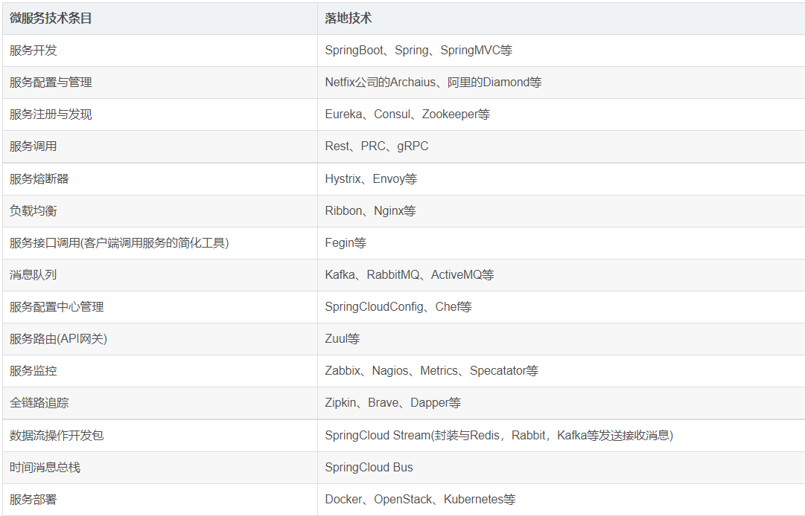
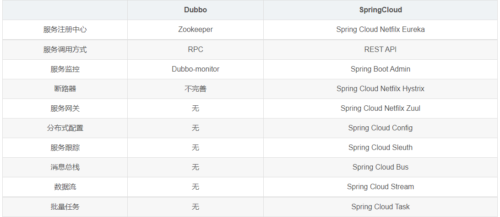

# SpringCloud

## 学习前言

#### 1.1 学习前提

- 熟练使用SpringBoot 微服务快速开发框架
- 了解过Dubbo + Zookeeper 分布式基础
- 电脑配置内存不低于8G(我自己的是16G)
  - 给大家看下多个服务跑起来后的内存开销图：


#### 1.2 文章大纲

> Spring Cloud 五大组件

- 服务注册与发现——**Netflix Eureka**
- 负载均衡：
  - 客户端负载均衡——**Netflix Ribbon**
  - 服务端负载均衡：——**Feign**(其也是依赖于Ribbon，只是将调用方式RestTemplete 更改成Service 接口)

- 断路器——**Netflix Hystrix**
- 服务网关——**Netflix Zuul**
- 分布式配置——**Spring Cloud Config**

#### 1.3 常见面试题

1.1 什么是微服务？

1.2 微服务之间是如何独立通讯的？

1.3 SpringCloud 和 Dubbo有那些区别？

1.4 SpringBoot 和 SpringCloud，请谈谈你对他们的理解

1.5 什么是服务熔断？什么是服务降级？

1.6 微服务的优缺点分别是什么？说下你在项目开发中遇到的坑

1.7 你所知道的微服务技术栈有哪些？列举一二

1.8 Eureka和Zookeeper都可以提供服务注册与发现的功能，请说说两者的区别

…

## 2. 微服务概述

#### 2.1 什么是微服务？

> 什么是微服务？

微服务(Microservice Architecture) 是近几年流行的一种架构思想，关于它的概念很难一言以蔽之。

究竟什么是微服务呢？我们在此引用ThoughtWorks 公司的首席科学家 Martin Fowler 于2014年提出的一段话：

原文：https://martinfowler.com/articles/microservices.html

汉化：https://www.cnblogs.com/liuning8023/p/4493156.html


* 就目前而言，对于微服务，业界并没有一个统一的，标准的定义。
* 但通常而言，微服务架构是一种架构模式，或者说是一种架构风格，它体长将单一的应用程序划分成一组小的服务，每个服务运行在其独立的自己的进程内，服务之间互相协调，互相配置，为用户提供最终价值，服务之间采用轻量级的通信机制(HTTP)互相沟通，每个服务都围绕着具体的业务进行构建，并且能狗被独立的部署到生产环境中，另外，应尽量避免统一的，集中式的服务管理机制，对具体的一个服务而言，应该根据业务上下文，选择合适的语言，工具(Maven)对其进行构建，可以有一个非常轻量级的集中式管理来协调这些服务，可以使用不同的语言来编写服务，也可以使用不同的数据存储。

> 再来从技术维度角度理解下：

- 微服务化的核心就是将传统的一站式应用，根据业务拆分成一个一个的服务，彻底地去耦合，每一个微服务提供单个业务功能的服务，一个服务做一件事情，从技术角度看就是一种小而独立的处理过程，类似进程的概念，能够自行单独启动或销毁，拥有自己独立的数据库。

#### 2.2 微服务与微服务架构

>  微服务

​			强调的是服务的大小，它关注的是某一个点，是具体解决某一个问题/提供落地对应服务的一个服务应用，狭义的看，可以看作是IDEA中的一个个微服务工程，或者Moudel。IDEA 工具里面使用Maven开发的一个个独立的小Moudel，它具体是使用SpringBoot开发的一个小模块，专业的事情交给专业的模块来做，一个模块就做着一件事情。强调的是一个个的个体，每个个体完成一个具体的任务或者功能。


> 微服务架构

一种新的架构形式，Martin Fowler 于2014年提出。

微服务架构是一种架构模式，它体长将单一应用程序划分成一组小的服务，服务之间相互协调，互相配合，为用户提供最终价值。每个服务运行在其独立的进程中，服务与服务之间采用轻量级的通信机制**(如HTTP)互相协作，每个服务都围绕着具体的业务进行构建，并且能够被独立的部署到生产环境中，另外，应尽量避免统一的，集中式的服务管理机制，对具体的一个服务而言，应根据业务上下文，选择合适的语言、工具(如Maven)**对其进行构建。

#### 2.3 微服务优缺点

> 优点

* 单一职责原则；
* 每个服务足够内聚，足够小，代码容易理解，这样能聚焦一个指定的业务功能或业务需求；
* 开发简单，开发效率高，一个服务可能就是专一的只干一件事；
* 微服务能够被小团队单独开发，这个团队只需2-5个开发人员组成；
* 微服务是松耦合的，是有功能意义的服务，无论是在开发阶段或部署阶段都是独立的；
* 微服务能使用不同的语言开发；易于和第三方集成，微服务允许容易且灵活的方式集成自动部署，通过持续集成工具，如jenkins，Hudson，bamboo；
* 微服务易于被一个开发人员理解，修改和维护，这样小团队能够更关注自己的工作成果，无需通过合作才能体现价值；
* 微服务允许利用和融合最新技术；
* **微服务只是业务逻辑的代码，不会和HTML，CSS，或其他的界面混合;**
* **每个微服务都有自己的存储能力，可以有自己的数据库，也可以有统一的数据库；**

> 缺点

- 开发人员要处理分布式系统的复杂性；
- 多服务运维难度，随着服务的增加，运维的压力也在增大；
- 系统部署依赖问题；
- 服务间通信成本问题；
- 数据一致性问题；
- 系统集成测试问题；
- 性能和监控问题；

#### 2.4 微服务技术栈有那些？



#### 2.5 为什么选择SpringCloud作为微服务架构

1. 选型依据

   - 整体解决方案和框架成熟度
   - 社区热度
   - 可维护性
   - 学习曲线

2. 当前各大IT公司用的微服务架构有那些？

   - 阿里：dubbo+HFS

   - 京东：JFS

   - 新浪：Motan

   - 当当网：DubboX

     …

3. 各微服务框架对比


## 3. SpringCloud入门概述

#### 3.1 SpringCloud是什么？

Spring官网：https://spring.io/


#### 3.2 SpringCloud和SpringBoot的关系

* SpringBoot专注于开苏方便的开发单个个体微服务；
* SpringCloud是关注全局的微服务协调整理治理框架，它将SpringBoot开发的一个个单体微服务，整合并管理起来，为各个微服务之间提供：配置管理、服务发现、断路器、路由、为代理、事件总栈、全局锁、决策竞选、分布式会话等等集成服务；
* SpringBoot可以离开SpringCloud独立使用，开发项目，但SpringCloud离不开SpringBoot，属于依赖关系；
* SpringBoot专注于快速、方便的开发单个个体微服务，SpringCloud关注全局的服务治理框架；
  

#### 3.3 Dubbo 和 SpringCloud技术选型

##### 1. 分布式+服务治理Dubbo

目前成熟的互联网架构，应用服务化拆分 + 消息中间件

##### 2. Dubbo 和 SpringCloud对比

可以看一下社区活跃度：

https://github.com/dubbo

https://github.com/spring-cloud

**对比结果：**



**最大区别：Spring Cloud 抛弃了Dubbo的RPC通信，采用的是基于HTTP的REST方式**

严格来说，这两种方式各有优劣。虽然从一定程度上来说，后者牺牲了服务调用的性能，但也避免了上面提到的原生RPC带来的问题。而且REST相比RPC更为灵活，服务提供方和调用方的依赖只依靠一纸契约，不存在代码级别的强依赖，这个优点在当下强调快速演化的微服务环境下，显得更加合适。

**品牌机和组装机的区别**

**社区支持与更新力度的区别**

**总结：**二者解决的问题域不一样：Dubbo的定位是一款RPC框架，而SpringCloud的目标是微服务架构下的一站式解决方案。

#### 3.4 SpringCloud能干嘛？

* Distributed/versioned configuration 分布式/版本控制配置
* Service registration and discovery 服务注册与发现
* Routing 路由
* Service-to-service calls 服务到服务的调用
* Load balancing 负载均衡配置
* Circuit Breakers 断路器
* Distributed messaging 分布式消息管理
* …
  

#### 3.5 SpringCloud下载

官网：http://projects.spring.io/spring-cloud/

版本号有点特别：


SpringCloud没有采用数字编号的方式命名版本号，而是采用了伦敦地铁站的名称，同时根据字母表的顺序来对应版本时间顺序，比如最早的Realse版本：Angel，第二个Realse版本：Brixton，然后是Camden、Dalston、Edgware，目前最新的是Hoxton SR4 CURRENT GA通用稳定版。

**自学参考书：**

* SpringCloud Netflix 中文文档：https://springcloud.cc/spring-cloud-netflix.html
* SpringCloud 中文API文档(官方文档翻译版)：https://springcloud.cc/spring-cloud-dalston.html
* SpringCloud中国社区：http://springcloud.cn/
* SpringCloud中文网：https://springcloud.cc

## 4. SpringCloud Rest学习环境搭建：服务提供者

#### 4.1 介绍

- 我们会使用一个Dept部门模块做一个微服务通用案例**Consumer**消费者(**Client**)通过REST调用**Provider**提供者(**Server**)提供的服务。
- 回顾Spring，SpringMVC，Mybatis等以往学习的知识。
- Maven的分包分模块架构复习。

```
一个简单的Maven模块结构是这样的：

-- app-parent: 一个父项目(app-parent)聚合了很多子项目(app-util\app-dao\app-web...)
  |-- pom.xml
  |
  |-- app-core
  ||---- pom.xml
  |
  |-- app-web
  ||---- pom.xml
  ......
```

一个父工程带着多个Module子模块

MicroServiceCloud父工程(Project)下初次带着3个子模块(Module)

* microservicecloud-api 【封装的整体entity/接口/公共配置等】
* microservicecloud-consumer-dept-80 【服务提供者】
* microservicecloud-provider-dept-8001 【服务消费者】

#### 4.2 SpringCloud版本选择

**大版本说明**


**实际开发版本关系**


**使用后两个**

#### 4.3 创建父工程

- 新建父工程项目springcloud，切记**Packageing是pom模式**
- 主要是定义POM文件，将后续各个子模块公用的jar包等统一提取出来，类似一个抽象父类


```xml
<?xml version="1.0" encoding="UTF-8"?>
<project xmlns="http://maven.apache.org/POM/4.0.0"
         xmlns:xsi="http://www.w3.org/2001/XMLSchema-instance"
         xsi:schemaLocation="http://maven.apache.org/POM/4.0.0 http://maven.apache.org/xsd/maven-4.0.0.xsd">
    <modelVersion>4.0.0</modelVersion>

    <groupId>com.haust</groupId>
    <artifactId>springcloud</artifactId>
    <version>1.0-SNAPSHOT</version>
    
    <!--打包方式  pom-->
    <packaging>pom</packaging>

    <properties>
        <project.build.sourceEncoding>UTF-8</project.build.sourceEncoding>
        <maven.compiler.source>1.8</maven.compiler.source>
        <maven.compiler.target>1.8</maven.compiler.target>
        <junit.version>4.12</junit.version>
        <log4j.version>1.2.17</log4j.version>
        <lombok.version>1.16.18</lombok.version>
    </properties>

    <dependencyManagement>
        <dependencies>
            <dependency>
                <groupId>org.springframework.cloud</groupId>
                <artifactId>spring-cloud-alibaba-dependencies</artifactId>
                <version>0.2.0.RELEASE</version>
                <type>pom</type>
                <scope>import</scope>
            </dependency>
            <!--springCloud的依赖-->
            <dependency>
                <groupId>org.springframework.cloud</groupId>
                <artifactId>spring-cloud-dependencies</artifactId>
                <version>Greenwich.SR1</version>
                <type>pom</type>
                <scope>import</scope>
            </dependency>
            <!--SpringBoot-->
            <dependency>
                <groupId>org.springframework.boot</groupId>
                <artifactId>spring-boot-dependencies</artifactId>
                <version>2.1.4.RELEASE</version>
                <type>pom</type>
                <scope>import</scope>
            </dependency>
            <!--数据库-->
            <dependency>
                <groupId>mysql</groupId>
                <artifactId>mysql-connector-java</artifactId>
                <version>5.1.47</version>
            </dependency>
            <dependency>
                <groupId>com.alibaba</groupId>
                <artifactId>druid</artifactId>
                <version>1.1.10</version>
            </dependency>
            <!--SpringBoot 启动器-->
            <dependency>
                <groupId>org.mybatis.spring.boot</groupId>
                <artifactId>mybatis-spring-boot-starter</artifactId>
                <version>1.3.2</version>
            </dependency>
            <!--日志测试~-->
            <dependency>
                <groupId>ch.qos.logback</groupId>
                <artifactId>logback-core</artifactId>
                <version>1.2.3</version>
            </dependency>
            <dependency>
                <groupId>junit</groupId>
                <artifactId>junit</artifactId>
                <version>${junit.version}</version>
            </dependency>
            <dependency>
                <groupId>log4j</groupId>
                <artifactId>log4j</artifactId>
                <version>${log4j.version}</version>
            </dependency>
            <dependency>
                <groupId>org.projectlombok</groupId>
                <artifactId>lombok</artifactId>
                <version>${lombok.version}</version>
            </dependency>
        </dependencies>
    </dependencyManagement>

</project>
```

父工程为springcloud，其下有多个子mudule，详情参考完整代码了解