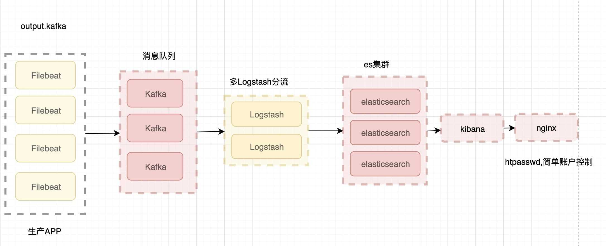
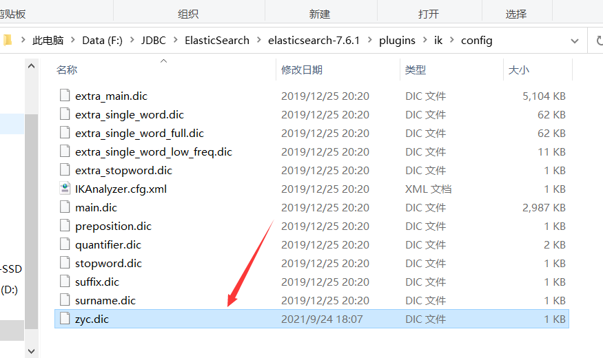

# ElasticSearch

## 了解ELK

`ELK`其实并不是一款软件，而是一整套解决方案，是三个软件产品的首字母缩写，`Elasticsearch`，`Logstash` 和 `Kibana`。这三款软件都是开源软件，通常是配合使用，而且又先后归于 Elastic.co 公司名下，故被简称为`ELK`协议栈


###  Elasticsearch

`Elasticsearch` 是一个实时的分布式搜索和分析引擎，它可以用于全文搜索，结构化搜索以及分析。它是一个建立在全文搜索引擎 `Apache Lucene`基础上的搜索引擎，使用`Java`语言编写

**主要特点** *实时分析* 分布式实时文件存储，并将每一个字段都编入索引 *文档导向，所有的对象全部是文档* 高可用性，易扩展，支持集群（Cluster）、分片和复制（Shards 和 Replicas）。见图 2 和图 3 * 接口友好，支持 JSON

### Logstash

`Logstash` 是一个具有实时渠道能力的数据收集引擎。使用 JRuby 语言编写。其作者是世界著名的运维工程师乔丹西塞 (JordanSissel)

**主要特点**

- 几乎可以访问任何数据
- 可以和多种外部应用结合
  - 支持弹性扩展

### Kibana

`Kibana`是一款基于 `Apache`开源协议，使用 `JavaScript`语言编写，为 `Elasticsearch`提供分析和可视化的 Web 平台。它可以在`Elasticsearch`的索引中查找，交互数据，并生成各种维度的表图.



## 1、ELK的安装的准备

### 1.1 ELK的下载地址

`注意版本对应`

> ElasticSearch:

 https://mirrors.huaweicloud.com/elasticsearch/?C=N&O=D

解压：


进入bin中点击elasticsearch.bat文件，即可启动elasticsearch


访问：http://localhost:9200/ 


> logstash:

 https://mirrors.huaweicloud.com/logstash/?C=N&O=D

> 可视化界面elasticsearch-head:

https://github.com/mobz/elasticsearch-head

必须要有前端基本配置，如node

从GitHub上下载并且解压

解压目录：


执行`npm install`,`npm run start`

访问：http://localhost:9100


测试发现，存在跨域问题，需要配置es

在es中的yml文件中增加配置

```yml
http.cors.enabled: true
http.cors.allow-origin: "*"
```

重启es，再次连接


点击索引，新建索引


代表创建成功，一开始就将索引当成数据库（可以建立索引（相当于数据库），文档（相当于数据库中的数据））。


这个head通常只当作数据展示工具，后面所有的都去Kibana中操作

> kibana: 

https://mirrors.huaweicloud.com/kibana/?C=N&O=D

下载完毕之后，直接解压，但是解压需要一些时间，是一个标准的工程。

好处：ELK基本上都是拆箱即用。

启动测试：

解压目录：


启动：


访问测试： http://localhost:5601


开发工具（PostMan）


之后的所有操作都在这里进行。

汉化：

国际化包：


找到Kibana的配置文件，编写配置重新启动即可。

```yml
i18n.locale: "zh-CN"
```


> ik分词器 

https://github.com/medcl/elasticsearch-analysis-ik

jdk必须是1.8及以上的版本

## 2、ES核心概念

`集群，节点，索引，类型，文档，分片，映射是什么？`

> elasticsearch是面向文档，关系型数据库和elasticsearch客观的对比！一切都是json

| Relational DB      | Elasticsearch   |
| ------------------ | --------------- |
| 数据库（database） | 索引（indices） |
| 表（tables）       | types           |
| 行（rows）         | documents       |
| 字段（columns）    | fields          |

物理设计：

elasticsearch在后台把每个索引划分成多个分片。每个分片可以在集群中的不同服务器间迁移

大数据平台默认一个也是一个集群，ES默认的集群名称叫elasticsearch


逻辑设计：

一个索引类型中，抱哈an多个文档，当我们索引一篇文档时，可以通过这样的一个顺序找到它：索引-》类型-》文档id，通过这个组合我们就能索引到某个具体的文档。注意：`ID不必是整数，实际上它是一个字符串。`

### 文档

> 文档

就是我们的一条条的记录

之前说elasticsearch是面向文档的,那么就意味着索弓和搜索数据的最小单位是文档, elasticsearch中,文档有几个重要属性:

* 自我包含, - -篇文档同时包含字段和对应的值,也就是同时包含key:value !
* 可以是层次型的，-一个文档中包含自文档,复杂的逻辑实体就是这么来的! {就是一 个json对象! fastjson进行自动转换!}
* 灵活的结构,文档不依赖预先定义的模式,我们知道关系型数据库中,要提前定义字段才能使用,在elasticsearch中,对于字段是非常灵活的,有时候,我们可以忽略该字段,或者动态的添加一个新的字段。
  

尽管我们可以随意的新增或者忽略某个字段,但是,每个字段的类型非常重要,比如一一个年龄字段类型,可以是字符串也可以是整形。因为elasticsearch会保存字段和类型之间的映射及其他的设置。这种映射具体到每个映射的每种类型,这也是为什么在elasticsearch中,类型有时候也称为映射类型。

### 类型

> 类型

类型是文档的逻辑容器,就像关系型数据库一样,表格是行的容器。类型中对于字段的定 义称为映射,比如name映射为字符串类型。我们说文档是无模式的 ,它们不需要拥有映射中所定义的所有字段,比如新增一个字段,那么elasticsearch是怎么做的呢?elasticsearch会自动的将新字段加入映射,但是这个字段的不确定它是什么类型, elasticsearch就开始猜,如果这个值是18 ,那么elasticsearch会认为它是整形。但是elasticsearch也可能猜不对 ，所以最安全的方式就是提前定义好所需要的映射,这点跟关系型数据库殊途同归了,先定义好字段,然后再使用,别整什么幺蛾子。

### 索引

> 索引

就是数据库!

索引是映射类型的容器, elasticsearch中的索引是一个非常大的文档集合。索|存储了映射类型的字段和其他设置。然后它们被存储到了各个分片上了。我们来研究下分片是如何工作的。

**物理设计:节点和分片如何工作**


一个集群至少有一 个节点,而一个节点就是一-个elasricsearch进程 ,节点可以有多个索引默认的,如果你创建索引,那么索引将会有个5个分片( primary shard ,又称主分片)构成的,每一个主分片会有-一个副本( replica shard ,又称复制分片）


上图是一个有3个节点的集群,可以看到主分片和对应的复制分片都不会在同-个节点内,这样有利于某个节点挂掉了,数据也不至于丢失。**实际上, 一个分片是- -个Lucene索引, -一个包含倒排索引的文件目录**,倒排索引的结构使得elasticsearch在不扫描全部文档的情况下,就能告诉你哪些文档包含特定的关键字。不过,等等,倒排索引是什么鬼?


### 倒排索引

> 倒排索引

elasticsearch使用的是一种称为倒排索引 |的结构,采用Lucene倒排索作为底层。这种结构适用于快速的全文搜索，一个索引由文
档中所有不重复的列表构成,对于每一个词,都有一个包含它的文档列表。 例如,现在有两个文档，每个文档包含如下内容:

```bash
Study every day， good good up to forever  # 文 档1包含的内容
To forever, study every day，good good up  # 文档2包含的内容
```

为为创建倒排索引,我们首先要将每个文档拆分成独立的词(或称为词条或者tokens) ,然后创建一一个包含所有不重 复的词条的排序列表,然后列出每个词条出现在哪个文档:

| term    | doc_1 | doc_2 |
| ------- | ----- | ----- |
| Study   | √     | x     |
| To      | x     | x     |
| every   | √     | √     |
| forever | √     | √     |
| day     | √     | √     |
| study   | x     | √     |
| good    | √     | √     |
| every   | √     | √     |
| to      | √     | x     |
| up      | √     | √     |

现在，我们试图搜索 to forever，只需要查看包含每个词条的文档

| term    | doc_1 | doc_2 |
| ------- | ----- | ----- |
| to      | √     | x     |
| forever | √     | √     |
| total   | 2     | 1     |

两个文档都匹配,但是第一个文档比第二个匹配程度更高。如果没有别的条件,现在,这两个包含关键字的文档都将返回。
再来看一个示例,比如我们通过博客标签来搜索博客文章。那么倒排索引列表就是这样的一个结构:

| 博客文章(原始数据) | 博客文章(原始数据) | 索引列表(倒排索引) | 索引列表(倒排索引) |
| ------------------ | ------------------ | ------------------ | ------------------ |
| 博客文章ID         | 标签               | 标签               | 博客文章ID         |
| 1                  | python             | python             | 1，2，3            |
| 2                  | python             | linux              | 3，4               |
| 3                  | linux，python      |                    |                    |
| 4                  | linux              |                    |                    |

如果要搜索含有python标签的文章,那相对于查找所有原始数据而言，查找倒排索引后的数据将会快的多。只需要查看标签这一栏,然后获取相关的文章ID即可。完全过滤掉无关的所有数据,提高效率!

elasticsearch的索引和Lucene的索引对比

在elasticsearch中，索引(库)这个词被频繁使用,这就是术语的使用。在elasticsearch中 ,索引被分为多个分片,每份分片是-个Lucene的索引。**所以一个elasticsearch索引是由多 个Lucene索引组成的。**别问为什么,谁让elasticsearch使用Lucene作为底层呢!如无特指，说起索引都是指elasticsearch的索引。

接下来的一切操作都在kibana中Dev Tools下的Console里完成。基础操作!

## IK分词器

> 什么是IK分词器 ?

分词:即把一-段中文或者别的划分成一个个的关键字,我们在搜索时候会把自己的信息进行分词,会把数据库中或者索引库中的数据进行分词,然后进行一个匹配操作,默认的中文分词是将每个字看成一个词,比如“我爱狂神”会被分为"我",“爱”,“狂”,“神” ,这显然是不符合要求的,所以我们需要安装中文分词器ik来解决这个问题。

如果要使用中文,建议使用ik分词器!

IK提供了两个分词算法: **ik_ smart和ik_ max_ word** ,其中ik_ smart为最少切分, ik_ max_ _word为最细粒度划分!一会我们测试!

什么是IK分词器：

- 把一句话分词
- 如果使用中文：推荐IK分词器
- 两个分词算法：ik_smart（最少切分），ik_max_word（最细粒度划分）

下载ik分词器

 https://github.com/medcl/elasticsearch-analysis-ik

解压到elasticsearch中的插件文件夹下，


重启ES，可以看到ik分词器被加载了


可以通过`elasticsearch-plugin list`命令查看加载的插件


使用Kibana测试：


**【ik_smart】测试：**

```json
GET _analyze
{
  "analyzer": "ik_smart",
  "text": "我是社会主义接班人"
}

//输出
{
  "tokens" : [
    {
      "token" : "我",
      "start_offset" : 0,
      "end_offset" : 1,
      "type" : "CN_CHAR",
      "position" : 0
    },
    {
      "token" : "是",
      "start_offset" : 1,
      "end_offset" : 2,
      "type" : "CN_CHAR",
      "position" : 1
    },
    {
      "token" : "社会主义",
      "start_offset" : 2,
      "end_offset" : 6,
      "type" : "CN_WORD",
      "position" : 2
    },
    {
      "token" : "接班人",
      "start_offset" : 6,
      "end_offset" : 9,
      "type" : "CN_WORD",
      "position" : 3
    }
  ]
}
```

**【ik_max_word】测试：**

```json
GET _analyze
{
  "analyzer": "ik_max_word",
  "text": "我是社会主义接班人"
}
//输出
{
  "tokens" : [
    {
      "token" : "我",
      "start_offset" : 0,
      "end_offset" : 1,
      "type" : "CN_CHAR",
      "position" : 0
    },
    {
      "token" : "是",
      "start_offset" : 1,
      "end_offset" : 2,
      "type" : "CN_CHAR",
      "position" : 1
    },
    {
      "token" : "社会主义",
      "start_offset" : 2,
      "end_offset" : 6,
      "type" : "CN_WORD",
      "position" : 2
    },
    {
      "token" : "社会",
      "start_offset" : 2,
      "end_offset" : 4,
      "type" : "CN_WORD",
      "position" : 3
    },
    {
      "token" : "主义",
      "start_offset" : 4,
      "end_offset" : 6,
      "type" : "CN_WORD",
      "position" : 4
    },
    {
      "token" : "接班人",
      "start_offset" : 6,
      "end_offset" : 9,
      "type" : "CN_WORD",
      "position" : 5
    },
    {
      "token" : "接班",
      "start_offset" : 6,
      "end_offset" : 8,
      "type" : "CN_WORD",
      "position" : 6
    },
    {
      "token" : "人",
      "start_offset" : 8,
      "end_offset" : 9,
      "type" : "CN_CHAR",
      "position" : 7
    }
  ]
}
```

> 输入我是周迎川

周迎川三个字是被拆开的。


> 要使得其不被分开，需要自定义词典，需要在ik分词器中增加自己的配置

新建一个字典：


写入关键词：


修改配置文件


编写配置


重启ES，查看细节


再次测试，查看效果

## 3、命令模式的使用

### 3.1 Rest风格说明

一种软件架构风格，而不是标准。更易于实现缓存等机制


>  基础测试

1.创建一个索引

```bash
PUT /索引名/类型名(高版本都不写了，都是_doc)/文档id
{请求体}
```


完成了自动添加了索引！数据也成功的添加了。


那么name这个字段用不用指定类型呢


指定字段的类型properties 就比如sql创表


获得这个规则！可以通过GET请求获得具体的信息


如果自己不设置文档字段类型，那么es会自动给默认类型


查看默认的类型：


如果自己的文档字段没有指定，那么ES会给我们默认配置字段类型。

### 3.2 cat命令

获取健康值


获取所有的信息

`GET _cat/indices?v`


还有很多 可以自动展示 都试试

### 3.3 关于索引的基本操作

> #### 修改索引

1.修改我们可以还是用原来的PUT的命令，根据id来修改


但是如果没有填写的字段 会重置为空了 ，相当于java接口传对象修改，如果只是传id的某些字段，那其他没传的值都为空了。

2.还有一种update方法 这种不设置某些值 数据不会丢失


> #### 删除索引

关于删除索引或者文档的操作

通过DELETE命令实现删除，根据你的请求来判断是删除索引还是删除文档记录

使用RESTFUL的风格是我们ES推荐大家使用的！


### 3.4 关于文档的基本操作（重点）

#### 查询

最简单的搜索是GET


#### 修改

更新数据  PUT

但是put不传值就会置为空值


推荐使用POST _update 这种方式，更加灵活，效率更高


#### 搜索

`GET zhou/user/1`

> 简单的条件查询，可以根据默认映射规则，产生基本查询。


**其中有一个score：表示匹配度高低，匹配度越高，分值越高。**

> 复杂操作搜索 select （排序，分页，高亮。模糊查询，精准查询）


输出结果过滤：相当于select name，desc


> 排序


> 分页查询


数据下标依然是从0开始的。

> 布尔值查询


must相当于sql中的and


should相当于sql中的or


must_not相当于sql中的not


注意：

- gt大于
- gte大于等于
- lte小于
- lte小于等于


> 精确查询

term查询时直接通过倒排索引指定词条进行精确查找的。

**关于分词：**

term：直接查询精确的。

match：会使用分词器解析，线分析文档，再通过分析的文档进行查询。

**两个类型 text keyword**

text：会被分词器解析

keyword：不会被分词器解析


默认的是被分词了


keyword没有被分词

**注意：keyword字段类型不会被分词器解析。**


精确查询多个值


> 高亮查询


还能自定义高亮的样式


## 4、springboot集成

### 4.1 引入依赖包

创建一个springboot的项目 同时勾选上`springboot-web`的包以及`Nosql的elasticsearch`的包

如果没有就手动引入

```xml
<!--es客户端-->
<dependency>
    <groupId>org.elasticsearch.client</groupId>
    <artifactId>elasticsearch-rest-high-level-client</artifactId>
    <version>7.6.1</version>
</dependency>

<!--springboot的elasticsearch服务-->
<dependency>
    <groupId>org.springframework.boot</groupId>
    <artifactId>spring-boot-starter-data-elasticsearch</artifactId>
</dependency>
```

注意下spring-boot的parent包内的依赖的es的版本是不是你对应的版本

不是的话就在pom文件下写个properties的版本

```xml
<!--这边配置下自己对应的版本-->
<properties>
    <java.version>11</java.version>
    <elasticsearch.version>7.6.1</elasticsearch.version>
</properties>
```

### 4.2注入RestHighLevelClient客户端

在主程序所在目录创建一个config目录，编写一个配置文件。

```java
package com.zhou.esapi.config;

import org.apache.http.HttpHost;
import org.elasticsearch.client.RestClient;
import org.elasticsearch.client.RestHighLevelClient;
import org.springframework.context.annotation.Bean;
import org.springframework.context.annotation.Configuration;


//Spring两步骤
//1.找到对象
//2.放入Spring容器中
//SpringBoot先分析源码
// xxxAutoConfiguration   xxxProperties
@Configuration      //相当于spring的xml文件
public class ElasticSearchClientConfig {

    @Bean
    public RestHighLevelClient restHighLevelClient(){
        RestHighLevelClient client  = new RestHighLevelClient(
                RestClient.builder(
                        new HttpHost("127.0.0.1",9200,"http")
                )
        );
        return client;
    }

}
```

### 4.3索引的增加、删除、是否存在

```java
package com.zhou.esapi;

import org.elasticsearch.action.admin.indices.delete.DeleteIndexRequest;
import org.elasticsearch.action.support.master.AcknowledgedResponse;
import org.elasticsearch.client.RequestOptions;
import org.elasticsearch.client.RestHighLevelClient;
import org.elasticsearch.client.indices.CreateIndexRequest;
import org.elasticsearch.client.indices.CreateIndexResponse;
import org.elasticsearch.client.indices.GetIndexRequest;
import org.junit.jupiter.api.Test;
import org.springframework.beans.factory.annotation.Autowired;
import org.springframework.boot.test.context.SpringBootTest;

import java.io.IOException;

@SpringBootTest
class EsApiApplicationTests {

//    面向对象操作
    @Autowired
    private RestHighLevelClient restHighLevelClient;


    //测试索引的创建  Request
    @Test
    void testCreateIndex() throws IOException {
        //1.创建索引的请求   PUT zhou_index
        CreateIndexRequest request = new CreateIndexRequest("zhou_index");
        //2客户端执行请求，请求后获得响应  IndicesClient
        CreateIndexResponse response = restHighLevelClient.indices().create(request, RequestOptions.DEFAULT);
        System.out.println(response);
    }


    //测试索引是否存在
    @Test
    void testExistIndex() throws IOException {
        //1.创建索引的请求
        GetIndexRequest request = new GetIndexRequest("zhou_index");
        //2客户端执行请求，请求后获得响应
        boolean exist =  restHighLevelClient.indices().exists(request, RequestOptions.DEFAULT);
        System.out.println("测试索引是否存在-----"+exist);
    }

    //删除索引
    @Test
    void testDeleteIndex() throws IOException {
        DeleteIndexRequest request = new DeleteIndexRequest("zhou_index");
//        删除
        AcknowledgedResponse delete = restHighLevelClient.indices().delete(request,RequestOptions.DEFAULT);
        System.out.println("删除索引--------"+delete.isAcknowledged());
    }

}
```

**遇到问题：**

**忘记导入junit测试依赖，导入即可。**

### 4.4 文档操作

```java
package com.zhou.esapi;

import com.alibaba.fastjson.JSON;
import com.zhou.esapi.pojo.User;
import org.elasticsearch.action.admin.indices.delete.DeleteIndexRequest;
import org.elasticsearch.action.bulk.BulkRequest;
import org.elasticsearch.action.bulk.BulkResponse;
import org.elasticsearch.action.delete.DeleteRequest;
import org.elasticsearch.action.delete.DeleteResponse;
import org.elasticsearch.action.get.GetRequest;
import org.elasticsearch.action.get.GetResponse;
import org.elasticsearch.action.index.IndexRequest;
import org.elasticsearch.action.index.IndexResponse;
import org.elasticsearch.action.search.SearchRequest;
import org.elasticsearch.action.search.SearchResponse;
import org.elasticsearch.action.support.master.AcknowledgedResponse;
import org.elasticsearch.action.update.UpdateRequest;
import org.elasticsearch.action.update.UpdateResponse;
import org.elasticsearch.client.RequestOptions;
import org.elasticsearch.client.RestHighLevelClient;
import org.elasticsearch.client.indices.CreateIndexRequest;
import org.elasticsearch.client.indices.CreateIndexResponse;
import org.elasticsearch.client.indices.GetIndexRequest;
import org.elasticsearch.common.unit.TimeValue;
import org.elasticsearch.common.xcontent.XContentType;
import org.elasticsearch.index.query.QueryBuilders;
import org.elasticsearch.index.query.TermQueryBuilder;
import org.elasticsearch.search.SearchHit;
import org.elasticsearch.search.builder.SearchSourceBuilder;
import org.elasticsearch.search.fetch.subphase.FetchSourceContext;
import org.junit.jupiter.api.Test;
import org.springframework.beans.factory.annotation.Autowired;
import org.springframework.boot.test.context.SpringBootTest;

import java.io.IOException;
import java.util.ArrayList;
import java.util.concurrent.TimeUnit;

@SpringBootTest
class EsApiApplicationTests {

//    面向对象操作
    @Autowired
    private RestHighLevelClient restHighLevelClient;


    //测试添加文档  put zhou_index/_doc/1
    @Test
    void testAddDocument() throws IOException {
        User user = new User("周迎川",21);
        IndexRequest request = new IndexRequest("zhou_index");
        request.id("1");
        //设置超时时间
//        request.timeout(TimeValue.timeValueSeconds(1));
        request.timeout("1s");
        //将数据放到json字符串,调用fastjson
        request.source(JSON.toJSONString(user), XContentType.JSON);
        //发送请求
        IndexResponse response = restHighLevelClient.index(request,RequestOptions.DEFAULT);
        System.out.println("添加文档-------"+response.toString());
        System.out.println("添加文档-------"+response.status());
//        结果
//        添加文档-------IndexResponse[index=zhou_index,type=_doc,id=1,version=1,result=created,seqNo=0,primaryTerm=1,shards={"total":2,"successful":1,"failed":0}]
//        添加文档-------CREATED
    }

    //测试文档是否存在  get zhou_index/_doc/1
    @Test
    void testExistDocument() throws IOException {
        //测试文档的 没有index
        GetRequest request= new GetRequest("zhou_index","1");
        //过滤，不返回_source的上下文了
        request.fetchSourceContext(new FetchSourceContext(false));
        request.storedFields("_none_");
        //没有indices()了
        boolean exist = restHighLevelClient.exists(request, RequestOptions.DEFAULT);
        System.out.println("测试文档是否存在-----"+exist);
    }

    //测试获取文档
    @Test
    void testGetDocument() throws IOException {
        GetRequest request= new GetRequest("zhou_index","1");
        GetResponse response = restHighLevelClient.get(request, RequestOptions.DEFAULT);
        System.out.println("测试获取文档-----"+response.getSourceAsString());
        System.out.println("测试获取文档-----"+response);

//        结果
//        测试获取文档-----{"age":21,"name":"zhou"}
//        测试获取文档-----{"_index":"zhou_index","_type":"_doc","_id":"1","_version":1,"_seq_no":0,"_primary_term":1,"found":true,"_source":{"age":27,"name":"lisen"}}

    }

    //测试修改文档
    @Test
    void testUpdateDocument() throws IOException {
        User user = new User("周迎川·", 18);
        //修改是id为1的
        UpdateRequest request= new UpdateRequest("zhou_index","1");
        request.timeout("1s");
//        fastjson
        request.doc(JSON.toJSONString(user),XContentType.JSON);

        UpdateResponse response = restHighLevelClient.update(request, RequestOptions.DEFAULT);
        System.out.println("测试修改文档-----"+response);
        System.out.println("测试修改文档-----"+response.status());

//        结果
//        测试修改文档-----UpdateResponse[index=zhou_index,type=_doc,id=1,version=2,seqNo=1,primaryTerm=1,result=updated,shards=ShardInfo{total=2, successful=1, failures=[]}]
//        测试修改文档-----OK

//        被删除的
//        测试获取文档-----null
//        测试获取文档-----{"_index":"zhou_index","_type":"_doc","_id":"1","found":false}
    }


    //测试删除文档
    @Test
    void testDeleteDocument() throws IOException {
        DeleteRequest request= new DeleteRequest("zhou_index","1");
        request.timeout("1s");
        DeleteResponse response = restHighLevelClient.delete(request, RequestOptions.DEFAULT);
        System.out.println("测试删除文档------"+response.status());
    }

    //测试批量添加文档
    @Test
    void testBulkAddDocument() throws IOException {
        ArrayList<User> userlist=new ArrayList<User>();
        userlist.add(new User("zyc1",5));
        userlist.add(new User("zyc2",6));
        userlist.add(new User("zyc3",40));
        userlist.add(new User("zyc4",25));
        userlist.add(new User("zyc5",15));
        userlist.add(new User("zyc6",35));

        //批量操作的Request
        BulkRequest request = new BulkRequest();
        request.timeout("1s");

        //批量处理请求
        for (int i = 0; i < userlist.size(); i++) {
//            批量修改,删除只需要修改这里
            request.add(
                    new IndexRequest("zhou_index")
                            .id(""+(i+1))
                            .source(JSON.toJSONString(userlist.get(i)),XContentType.JSON)
            );
        }
        BulkResponse response = restHighLevelClient.bulk(request, RequestOptions.DEFAULT);
        //response.hasFailures()是否是失败的
        System.out.println("测试批量添加文档-----"+response.hasFailures());

//        结果:false为成功 true为失败
//        测试批量添加文档-----false
    }


    //测试批量查询文档
    @Test
    void testSearchDocument() throws IOException {
        SearchRequest request = new SearchRequest("zhou_index");
        //构建搜索条件
        SearchSourceBuilder sourceBuilder = new SearchSourceBuilder();
        //设置了高亮
        sourceBuilder.highlighter();
        sourceBuilder.from();
//        sourceBuilder.size();
        //term name为zyc1的

//        构建查询条件
//        QueryBuilders.matchAllQuery();
        TermQueryBuilder termQueryBuilder = QueryBuilders.termQuery("name", "zyc1");
        sourceBuilder.query(termQueryBuilder);
        sourceBuilder.timeout(new TimeValue(60, TimeUnit.SECONDS));

        request.source(sourceBuilder);
        SearchResponse response = restHighLevelClient.search(request, RequestOptions.DEFAULT);

        System.out.println("测试查询文档-----"+JSON.toJSONString(response.getHits()));
        System.out.println("=====================");
        for (SearchHit documentFields : response.getHits().getHits()) {
            System.out.println("测试查询文档--遍历参数--"+documentFields.getSourceAsMap());
        }

//        测试查询文档-----{"fragment":true,"hits":[{"fields":{},"fragment":false,"highlightFields":{},"id":"1","matchedQueries":[],"primaryTerm":0,"rawSortValues":[],"score":1.8413742,"seqNo":-2,"sortValues":[],"sourceAsMap":{"name":"zyc1","age":5},"sourceAsString":"{\"age\":5,\"name\":\"zyc1\"}","sourceRef":{"fragment":true},"type":"_doc","version":-1}],"maxScore":1.8413742,"totalHits":{"relation":"EQUAL_TO","value":1}}
//        =====================
//        测试查询文档--遍历参数--{name=zyc1, age=5}
    }

}
```

## 实战

### 爬虫

> 数据问题，数据库获取，消息队列中获取，都可以成为数据源，还可以通过爬虫 

1. 导入依赖

```xml
<!--        解析网页： JSoup包-->
        <dependency>
            <groupId>org.jsoup</groupId>
            <artifactId>jsoup</artifactId>
            <version>1.10.2</version>
        </dependency>
```

爬虫代码

```java
package com.zhou.utils;

import com.zhou.pojo.Content;
import org.jsoup.Jsoup;
import org.jsoup.nodes.Document;
import org.jsoup.nodes.Element;
import org.jsoup.select.Elements;

import java.net.URL;
import java.util.ArrayList;
import java.util.List;

public class HtmlParseUtil {

    public static void main(String[] args) throws Exception {
        new HtmlParseUtil().parseJD("java").forEach(System.out::println);
    }

    public List<Content> parseJD(String keywords) throws Exception {
        //    获取请求    https://search.jd.com/Search?keyword=java&enc=utf-8&wq=java&pvid=e337722f37f4450aa37e296f09fc98e3
//    前提，需要联网， ajax数据不能获取，需要模拟浏览器才能获取ajax数据
        String url = "https://search.jd.com/Search?keyword="+keywords;
//    解析网页 (Jsoup 返回的Document对象就是浏览器的Document对象）
        Document document = Jsoup.parse(new URL(url), 30000);
//      在JS中能使用的方法，这里都能使用
        Element element = document.getElementById("J_goodsList");
//        获取所有的li标签
        Elements lis = element.getElementsByTag("li");
        List<Content> contents = new ArrayList<>();
//        获取元素中的内容
        for (Element li : lis) {
//            很多公司开发，出于性能考虑，通常会进行懒加载图片
            String img = li.getElementsByTag("img").eq(0).attr("source-data-lazy");
            String price = li.getElementsByClass("p-price").eq(0).text();
            String title = li.getElementsByClass("p-name").eq(0).text();
            Content content = new Content(img,title,price);
            contents.add(content);
        }

        return contents;
    }
}
```

### 搜索高亮

```java
   //   3、高亮
    public List<Map<String,Object>> searchHighLight(String keywords, int pageNo, int pageSize) throws IOException {
        if(pageNo <= 1){
            pageNo = 1 ;
        }
//        条件搜索
        SearchRequest searchRequest = new SearchRequest("jd_goods");
        SearchSourceBuilder searchSourceBuilder = new SearchSourceBuilder();

//        分页
        searchSourceBuilder.from(pageNo);
        searchSourceBuilder.size(pageSize);

//        精准匹配
        TermQueryBuilder termQueryBuilder = QueryBuilders.termQuery("title", keywords);
        searchSourceBuilder.query(termQueryBuilder);
        searchSourceBuilder.timeout(new TimeValue(60, TimeUnit.SECONDS));

//        高亮
        HighlightBuilder highlightBuilder = new HighlightBuilder();
        highlightBuilder.field("title");
        highlightBuilder.requireFieldMatch(false);  //是否需要多个字段高亮
        highlightBuilder.preTags("<span style = 'color: red'");
        highlightBuilder.postTags("</span>");
        searchSourceBuilder.highlighter(highlightBuilder);

//        执行搜索
        searchRequest.source(searchSourceBuilder);
        SearchResponse searchResponse = restHighLevelClient.search(searchRequest, RequestOptions.DEFAULT);

//        解析结果
        ArrayList<Map<String, Object>> list = new ArrayList<>();
        for (SearchHit hit : searchResponse.getHits().getHits()) {
            Map<String, HighlightField> highlightFields = hit.getHighlightFields();//获取高亮字段
            HighlightField title = highlightFields.get("title");
            Map<String, Object> sourceAsMap = hit.getSourceAsMap(); //原来的结果
//            解析高亮字段
            if (title != null){
                Text[] fragments = title.fragments();
                String newTitle = "";
                for (Text fragment : fragments) {
                    newTitle += fragment;
                }
                sourceAsMap.put("title",newTitle);  //高亮字段替换原来的内容
            }

            list.add(sourceAsMap);
        }
        return list;
    }
```


**完整代码**

项目结构


依赖

```xml
 <properties>
        <java.version>11</java.version>
        <repackage.classifier/>
        <spring-native.version>0.10.3</spring-native.version>
        <!--        自定义es版本依赖，保证与本地一致-->
        <elasticsearch.version>7.6.1</elasticsearch.version>
    </properties>
    <dependencies>

<!--        解析电影，音乐用tika -->
<!--        解析网页： JSoup包-->
        <dependency>
            <groupId>org.jsoup</groupId>
            <artifactId>jsoup</artifactId>
            <version>1.10.2</version>
        </dependency>
        <!--        导入了elasticsearch依赖-->
        <dependency>
            <groupId>org.springframework.boot</groupId>
            <artifactId>spring-boot-starter-data-elasticsearch</artifactId>
        </dependency>
        <dependency>
            <groupId>org.springframework.boot</groupId>
            <artifactId>spring-boot-starter-web</artifactId>
        </dependency>

        <dependency>
            <groupId>org.springframework.boot</groupId>
            <artifactId>spring-boot-devtools</artifactId>
            <scope>runtime</scope>
            <optional>true</optional>
        </dependency>
        <dependency>
            <groupId>org.springframework.boot</groupId>
            <artifactId>spring-boot-configuration-processor</artifactId>
            <optional>true</optional>
        </dependency>
        <dependency>
            <groupId>org.projectlombok</groupId>
            <artifactId>lombok</artifactId>
            <optional>true</optional>
        </dependency>
        <dependency>
            <groupId>org.springframework.boot</groupId>
            <artifactId>spring-boot-starter-test</artifactId>
            <scope>test</scope>
        </dependency>
        <dependency>
            <groupId>junit</groupId>
            <artifactId>junit</artifactId>
            <version>4.12</version>
            <scope>test</scope>
        </dependency>
        <dependency>
            <groupId>com.alibaba</groupId>
            <artifactId>fastjson</artifactId>
            <version>1.2.78</version>
        </dependency>
    </dependencies>

    <build>
        <plugins>
            <plugin>
                <groupId>org.springframework.boot</groupId>
                <artifactId>spring-boot-maven-plugin</artifactId>
                <configuration>
                    <excludes>
                        <exclude>
                            <groupId>org.projectlombok</groupId>
                            <artifactId>lombok</artifactId>
                        </exclude>
                    </excludes>
                </configuration>
            </plugin>
        </plugins>
    </build>

```

主程序

```java
package com.zhou;

import org.springframework.boot.SpringApplication;
import org.springframework.boot.autoconfigure.SpringBootApplication;

@SpringBootApplication
public class EsJdApplication {

    public static void main(String[] args) {
        SpringApplication.run(EsJdApplication.class, args);
    }

}
```

实体类

```java
package com.zhou.pojo;

import lombok.AllArgsConstructor;
import lombok.Data;
import lombok.NoArgsConstructor;

@Data
@AllArgsConstructor
@NoArgsConstructor
public class Content {
    private String img;
    private String name;
    private String price;
}

```

解析页面工具类

```java
package com.zhou.utils;

import com.zhou.pojo.Content;
import org.jsoup.Jsoup;
import org.jsoup.nodes.Document;
import org.jsoup.nodes.Element;
import org.jsoup.select.Elements;

import java.net.URL;
import java.util.ArrayList;
import java.util.List;

public class HtmlParseUtil {

    public static void main(String[] args) throws Exception {
        new HtmlParseUtil().parseJD("java").forEach(System.out::println);
    }

    public List<Content> parseJD(String keywords) throws Exception {
        //    获取请求    https://search.jd.com/Search?keyword=java&enc=utf-8&wq=java&pvid=e337722f37f4450aa37e296f09fc98e3
//    前提，需要联网， ajax数据不能获取，需要模拟浏览器才能获取ajax数据
        String url = "https://search.jd.com/Search?keyword="+keywords;
//    解析网页 (Jsoup 返回的Document对象就是浏览器的Document对象）
        Document document = Jsoup.parse(new URL(url), 30000);
//      在JS中能使用的方法，这里都能使用
        Element element = document.getElementById("J_goodsList");
//        获取所有的li标签
        Elements lis = element.getElementsByTag("li");
        List<Content> contents = new ArrayList<>();
//        获取元素中的内容
        for (Element li : lis) {
//            很多公司开发，出于性能考虑，通常会进行懒加载图片
            String img = li.getElementsByTag("img").eq(0).attr("source-data-lazy");
            String price = li.getElementsByClass("p-price").eq(0).text();
            String title = li.getElementsByClass("p-name").eq(0).text();
            Content content = new Content(img,title,price);
            contents.add(content);
        }

        return contents;
    }
}
```

ES配置类

```java
package com.zhou.config;

import org.apache.http.HttpHost;
import org.elasticsearch.client.RestClient;
import org.elasticsearch.client.RestHighLevelClient;
import org.springframework.context.annotation.Bean;
import org.springframework.context.annotation.Configuration;


//Spring两步骤
//1.找到对象
//2.放入Spring容器中
//SpringBoot先分析源码
// xxxAutoConfiguration   xxxProperties
@Configuration      //相当于spring的xml文件
public class ElasticSearchClientConfig {

    @Bean
    public RestHighLevelClient restHighLevelClient(){
        RestHighLevelClient client  = new RestHighLevelClient(
                RestClient.builder(
                        new HttpHost("127.0.0.1",9200,"http")
                )
        );
        return client;
    }

}
```

ES服务层

```java
package com.zhou.service;

import com.alibaba.fastjson.JSON;
import com.zhou.pojo.Content;
import com.zhou.utils.HtmlParseUtil;
import org.elasticsearch.action.bulk.BulkRequest;
import org.elasticsearch.action.bulk.BulkResponse;
import org.elasticsearch.action.index.IndexRequest;
import org.elasticsearch.action.search.SearchRequest;
import org.elasticsearch.action.search.SearchResponse;
import org.elasticsearch.client.RequestOptions;
import org.elasticsearch.client.RestHighLevelClient;
import org.elasticsearch.common.text.Text;
import org.elasticsearch.common.unit.TimeValue;
import org.elasticsearch.common.xcontent.XContentType;
import org.elasticsearch.index.query.QueryBuilders;
import org.elasticsearch.index.query.TermQueryBuilder;
import org.elasticsearch.search.SearchHit;
import org.elasticsearch.search.builder.SearchSourceBuilder;
import org.elasticsearch.search.fetch.subphase.highlight.HighlightBuilder;
import org.elasticsearch.search.fetch.subphase.highlight.HighlightField;
import org.springframework.beans.factory.annotation.Autowired;
import org.springframework.stereotype.Service;

import java.io.IOException;
import java.util.ArrayList;
import java.util.List;
import java.util.Map;
import java.util.concurrent.TimeUnit;

//业务编写
@Service
public class ContentService {

    @Autowired
    private RestHighLevelClient restHighLevelClient;

//    1.解析索引放入 ES 索引中
    public Boolean parseContent(String keywords) throws Exception {
        List<Content> contents = new HtmlParseUtil().parseJD(keywords);
//        把查询到的数据放入ES
        BulkRequest bulkRequest = new BulkRequest();
        bulkRequest.timeout("2m");

        for (int i = 0; i < contents.size(); i++) {
            bulkRequest.add(
                    new IndexRequest("jd_goods")
                    .source(JSON.toJSONString(contents.get(i)), XContentType.JSON)
            );
        }

        BulkResponse bulk = restHighLevelClient.bulk(bulkRequest, RequestOptions.DEFAULT);
        return !bulk.hasFailures();
    }


//    2.获取搜索数据
    public List<Map<String,Object>> searchPage(String keywords, int pageNo, int pageSize) throws IOException {
        if(pageNo <= 1){
            pageNo = 1 ;
        }
//        条件搜索
        SearchRequest searchRequest = new SearchRequest("jd_goods");
        SearchSourceBuilder searchSourceBuilder = new SearchSourceBuilder();

//        分页
        searchSourceBuilder.from(pageNo);
        searchSourceBuilder.size(pageSize);

//        精准匹配
        TermQueryBuilder termQueryBuilder = QueryBuilders.termQuery("title", keywords);
        searchSourceBuilder.query(termQueryBuilder);
        searchSourceBuilder.timeout(new TimeValue(60, TimeUnit.SECONDS));

//        执行搜索
        searchRequest.source(searchSourceBuilder);
        SearchResponse searchResponse = restHighLevelClient.search(searchRequest, RequestOptions.DEFAULT);

//        解析结果
        ArrayList<Map<String, Object>> list = new ArrayList<>();
        for (SearchHit hit : searchResponse.getHits().getHits()) {
            list.add(hit.getSourceAsMap());
        }
        return list;
    }


    //   3、高亮
    public List<Map<String,Object>> searchHighLight(String keywords, int pageNo, int pageSize) throws IOException {
        if(pageNo <= 1){
            pageNo = 1 ;
        }
//        条件搜索
        SearchRequest searchRequest = new SearchRequest("jd_goods");
        SearchSourceBuilder searchSourceBuilder = new SearchSourceBuilder();

//        分页
        searchSourceBuilder.from(pageNo);
        searchSourceBuilder.size(pageSize);

//        精准匹配
        TermQueryBuilder termQueryBuilder = QueryBuilders.termQuery("title", keywords);
        searchSourceBuilder.query(termQueryBuilder);
        searchSourceBuilder.timeout(new TimeValue(60, TimeUnit.SECONDS));

//        高亮
        HighlightBuilder highlightBuilder = new HighlightBuilder();
        highlightBuilder.field("title");
        highlightBuilder.requireFieldMatch(false);  //是否需要多个字段高亮
        highlightBuilder.preTags("<span style = 'color: red'");
        highlightBuilder.postTags("</span>");
        searchSourceBuilder.highlighter(highlightBuilder);

//        执行搜索
        searchRequest.source(searchSourceBuilder);
        SearchResponse searchResponse = restHighLevelClient.search(searchRequest, RequestOptions.DEFAULT);

//        解析结果
        ArrayList<Map<String, Object>> list = new ArrayList<>();
        for (SearchHit hit : searchResponse.getHits().getHits()) {
            Map<String, HighlightField> highlightFields = hit.getHighlightFields();//获取高亮字段
            HighlightField title = highlightFields.get("title");
            Map<String, Object> sourceAsMap = hit.getSourceAsMap(); //原来的结果
//            解析高亮字段
            if (title != null){
                Text[] fragments = title.fragments();
                String newTitle = "";
                for (Text fragment : fragments) {
                    newTitle += fragment;
                }
                sourceAsMap.put("title",newTitle);  //高亮字段替换原来的内容
            }

            list.add(sourceAsMap);
        }
        return list;
    }

}
```

控制层

```java
package com.zhou.controller;


import com.zhou.service.ContentService;
import org.springframework.beans.factory.annotation.Autowired;
import org.springframework.web.bind.annotation.GetMapping;
import org.springframework.web.bind.annotation.PathVariable;
import org.springframework.web.bind.annotation.RestController;

import java.io.IOException;
import java.util.List;
import java.util.Map;

@RestController
public class ContentController {

    @Autowired
    private ContentService contentService;

    @GetMapping("/parse/{keywords}")
    public Boolean parse(@PathVariable("keywords") String keywords) throws Exception {
        return contentService.parseContent(keywords);
    }

    @GetMapping("/search/{keywords}/{pageNo}/{pageSize}")
    public List<Map<String,Object>> search(@PathVariable("keywords") String keywords,
                                           @PathVariable("pageNo") int pageNo,
                                           @PathVariable("pageSize") int pageSize) throws IOException {
        return contentService.searchPage(keywords,pageNo,pageSize);
    }


    @GetMapping("/searchhighlight/{keywords}/{pageNo}/{pageSize}")
    public List<Map<String,Object>> searchHighLight(@PathVariable("keywords") String keywords,
                                           @PathVariable("pageNo") int pageNo,
                                           @PathVariable("pageSize") int pageSize) throws IOException {
        return contentService.searchHighLight(keywords,pageNo,pageSize);
    }
}
```

