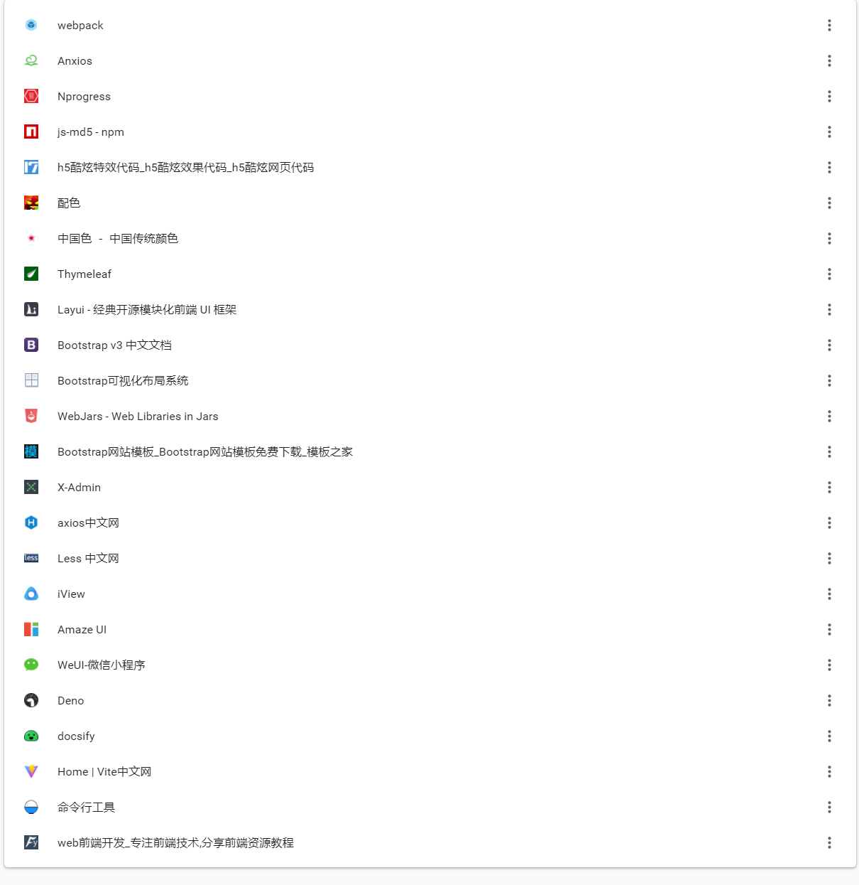
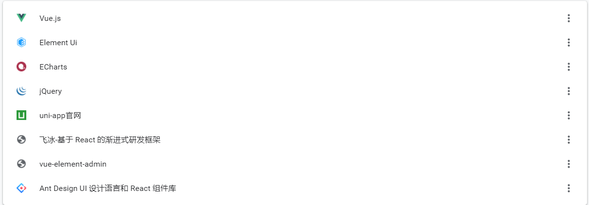
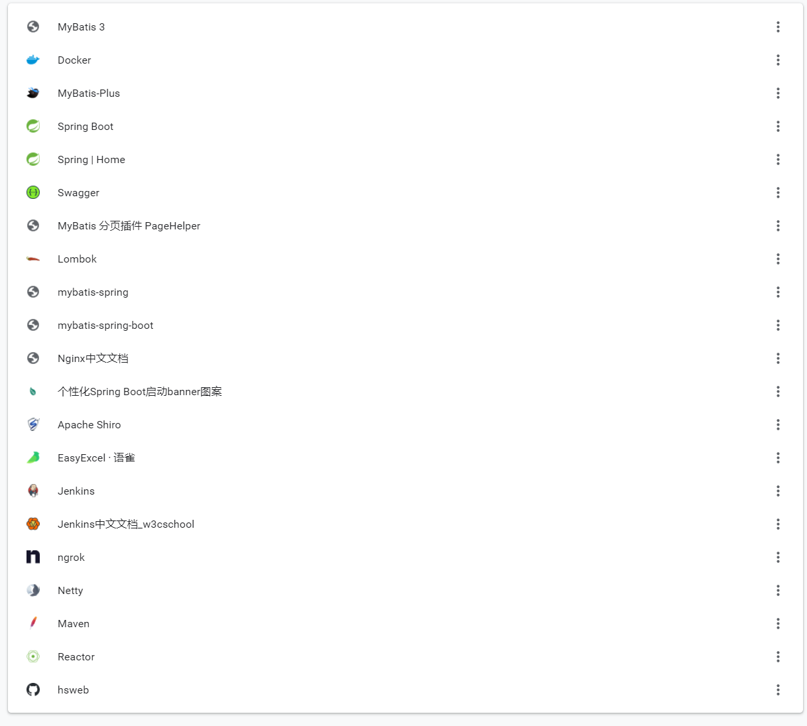
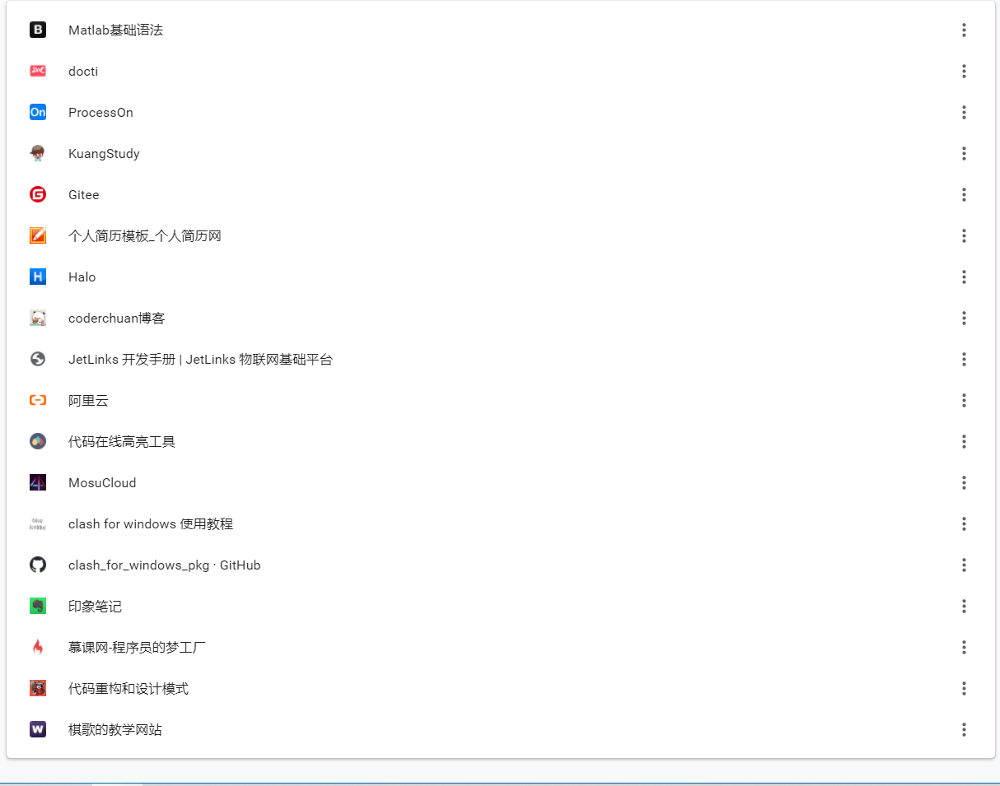
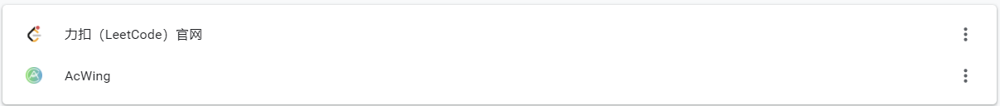
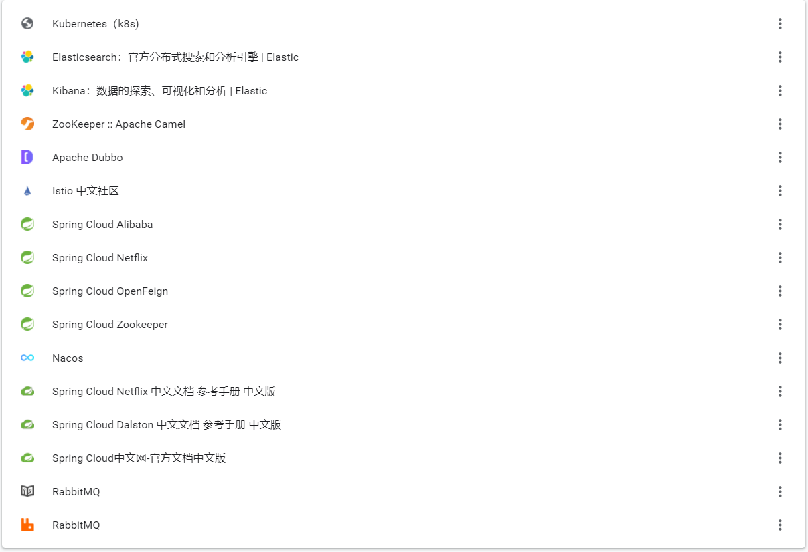
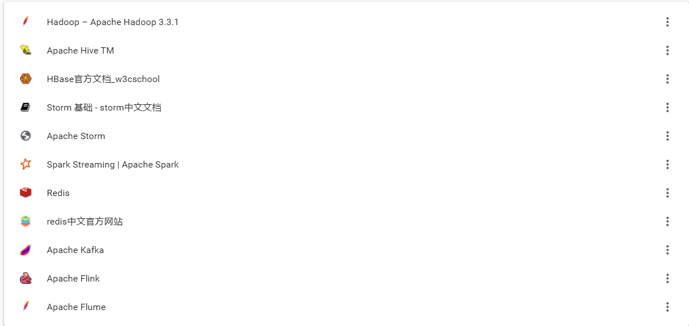
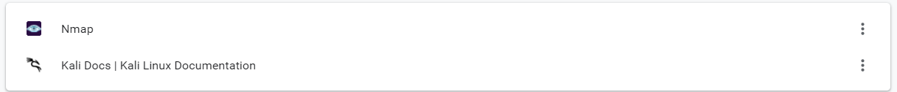
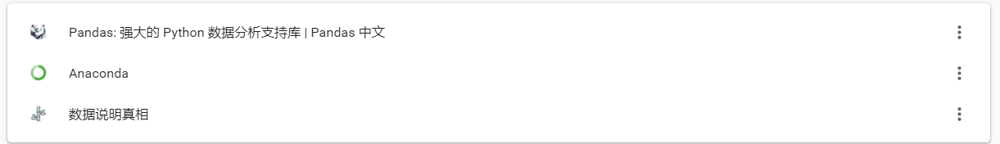
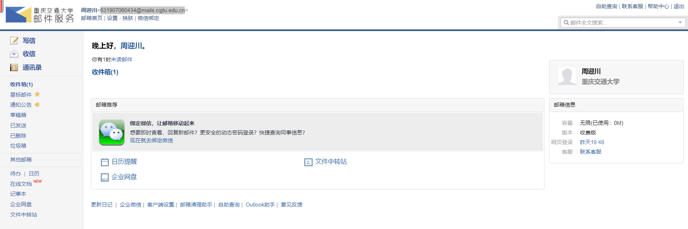

# FrontEnd

https://webpack.docschina.org/

https://www.kancloud.cn/yunye/axios/234845
https://madewith.cn/23
https://www.npmjs.com/package/js-md5
https://www.17sucai.com/pins/tag/12350.html
https://color.uisdc.com/pick.html
http://zhongguose.com/
https://www.thymeleaf.org/
https://www.layui.com/
https://v3.bootcss.com/
https://www.bootcss.com/p/layoutit/
https://www.webjars.org/

http://www.cssmoban.com/tags.asp?n=Bootstrap
http://x.xuebingsi.com/
http://www.axios-js.com/
http://lesscss.cn/
http://v1.iviewui.com/
http://amazeui.shopxo.net/
https://weui.io/
https://deno.land/
https://docsify.js.org/#/
https://vitejs.cn/
https://umijs.org/zh-CN/docs/cli
https://www.fly63.com/

# JavaScript

	

https://cn.vuejs.org/v2/guide/
https://element.eleme.cn/#/zh-CN/component/installation
https://echarts.apache.org/examples/zh/index.html
https://jquery.com/
https://uniapp.dcloud.io/README
https://ice.work/
https://panjiachen.github.io/vue-element-admin-site/zh/
https://ant.design/index-cn

# BackEnd

https://mybatis.org/mybatis-3/zh/index.html
https://www.docker.com/
https://mp.baomidou.com/
https://spring.io/projects/spring-boot
https://spring.io/
https://swagger.io/
https://pagehelper.github.io/
https://projectlombok.org/
http://mybatis.org/spring-boot-starter/mybatis-spring-boot-autoconfigure/index.html
http://mybatis.org/spring/zh/index.html
https://www.nginx.cn/doc/
https://www.bootschool.net/ascii-art
https://shiro.apache.org/

https://www.jenkins.io/
https://www.yuque.com/easyexcel/doc/easyexcel
https://www.w3cschool.cn/jenkins/
https://ngrok.com/
https://netty.io/index.html
https://maven.apache.org/
https://projectreactor.io/
https://github.com/hs-web

# SomeThing

https://www.yiibai.com/matlab/matlab_syntax.html
http://docti.xuling.top/#/login?redirect=%2Fdashborad
https://www.processon.com/
https://www.kuangstudy.com/course?cid=1
https://gitee.com/
http://www.gerenjianli.com/moban/
https://halo.run/
http://47.108.159.136/
http://doc.jetlinks.cn/dev-guide/start.html#%E9%85%8D%E7%BD%AE
https://www.aliyun.com/?utm_content=se_1009145079
https://highlightcode.com/
https://mosucloud.host/clientarea.php

https://github.com/Fndroid/clash_for_windows_pkg/releases
https://loukky.com/archives/1337
https://www.yinxiang.com/
https://www.imooc.com/?utm_term=%E6%85%95%E8%AF%BE%E7%BD%91&utm_campaign=SEM&utm_source=bdpinpai&bd_vid=7672380288934254165
https://refactoringguru.cn/
http://qige.io/

# Algorithm

https://leetcode-cn.com/
https://www.acwing.com/

# 微服务

https://www.kubernetes.org.cn/k8s
https://www.elastic.co/cn/elasticsearch/
https://www.elastic.co/cn/kibana/
https://camel.apache.org/components/latest/zookeeper-component.html
https://dubbo.apache.org/zh/
https://istio.cn/
https://spring.io/projects/spring-cloud-alibaba
https://spring.io/projects/spring-cloud-netflix
https://spring.io/projects/spring-cloud-openfeign
https://spring.io/projects/spring-cloud-zookeeper
https://nacos.io/zh-cn/
https://www.springcloud.cc/spring-cloud-netflix.html
https://www.springcloud.cc/spring-cloud-dalston.html
https://www.springcloud.cc/
http://rabbitmq.mr-ping.com/description.html
https://www.rabbitmq.com/

# 大数据

https://hadoop.apache.org/docs/stable/index.html
https://hive.apache.org/
https://www.w3cschool.cn/hbase_doc/
https://doc.codingdict.com/storm/1/
http://storm.apache.org/
http://spark.apache.org/streaming/
https://redis.io/
http://www.redis.cn/
http://kafka.apache.org/
https://flink.apache.org/
http://flume.apache.org/

# 网络

https://nmap.org/download.html
https://www.kali.org/docs/

# Python

http://www.pypandas.cn/docs/
https://www.anaconda.com/
https://michaelguan.github.io/

# 我的CQJTU邮箱

631907060434@mails.cqjtu.edu.cn

